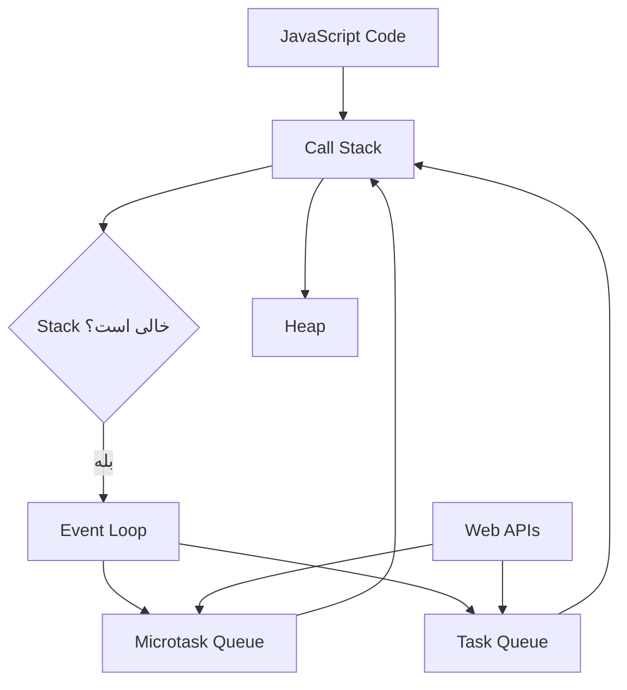
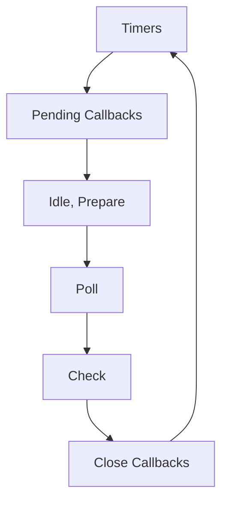

# Event Loop در JavaScript: راهنمای جامع از مقدماتی تا پیشرفته

---

## خلاصه خیلی ساده برای مبتدی‌ها

**Event Loop** (حلقه رویداد) مکانیزمی است که به JavaScript اجازه می‌دهد عملیات غیرهم‌زمان (Asynchronous) را مدیریت کند، با اینکه JavaScript **Single-threaded** (تک‌نخی) است.

تصور کن JavaScript مثل یک آشپز است که فقط یک دست دارد (یک Thread). این آشپز:
1. دستورهای پخت را **یکی‌یکی** از روی لیست (Call Stack) اجرا می‌کند
2. وقتی کاری زمان‌بر است (مثل پختن برنج)، آن را به دستیار (Web APIs) می‌سپارد
3. وقتی دستیار کارش تمام شد، پیامی می‌فرستد که در صف (Queue) قرار می‌گیرد
4. آشپز بعد از تمام کارهای فعلی، به صف نگاه می‌کند و کار بعدی را شروع می‌کند

این چرخه تکرار می‌شود و به آن **Event Loop** می‌گویند.

---

## 1. مقدمه‌ای بر Event Loop

### 1.1 Event Loop چیست؟

**تعریف ساده:** Event Loop یک مکانیزم است که اجازه می‌دهد JavaScript عملیات غیرهم‌زمان را بدون نیاز به چندین Thread مدیریت کند.

**تعریف فنی:** Event Loop یک حلقه بی‌نهایت است که به‌طور مداوم Call Stack را بررسی می‌کند و در صورت خالی بودن، Callbackهای موجود در Queueها را برای اجرا به Stack منتقل می‌کند.

**چرا JavaScript به Event Loop نیاز دارد؟**

JavaScript در ابتدا برای اجرای ساده در مرورگر طراحی شد و Single-threaded است. اما برای تعامل با کاربر، درخواست‌های شبکه و عملیات زمان‌بر، نیاز به اجرای غیرهم‌زمان دارد. Event Loop این امکان را فراهم می‌کند.

**مثال ساده:**

```javascript
console.log("شروع");

setTimeout(() => {
  console.log("بعد از ۲ ثانیه");
}, 2000);

console.log("پایان");
```

**خروجی:**
```
شروع
پایان
بعد از ۲ ثانیه
```

چرا "بعد از ۲ ثانیه" آخر چاپ شد؟ چون `setTimeout` یک عملیات غیرهم‌زمان است و Callback آن در صف قرار می‌گیرد تا بعد از اتمام کدهای هم‌زمان اجرا شود.

### 1.2 چرا درک Event Loop مهم است؟

1. **پیش‌بینی ترتیب اجرای کد:** بدون درک Event Loop، نمی‌توانید بفهمید چرا کدها به ترتیب خاصی اجرا می‌شوند
2. **درک رفتار `setTimeout`:** چرا `setTimeout(..., 0)` فوراً اجرا نمی‌شود؟
3. **درک Promise و `async/await`:** چرا Callbackهای Promise قبل از `setTimeout` اجرا می‌شوند؟
4. **جلوگیری از اشتباهات رایج:** مثل Race Condition، Blocking شدن UI و Starvation
5. **Performance و Responsive بودن:** درک اینکه چگونه کدهای سنگین می‌توانند رابط کاربری را فریز کنند

### 1.3 آیا JavaScript هم‌زمان است یا غیرهم‌زمان؟

**Synchronous (هم‌زمان):** کدها خط‌به‌خط و به ترتیب اجرا می‌شوند. هر خط منتظر خط قبلی می‌ماند.

```javascript
console.log("A");
console.log("B");
console.log("C");
// خروجی: A, B, C (به ترتیب)
```

**Asynchronous (غیرهم‌زمان):** برخی عملیات بلافاصله نتیجه نمی‌دهند و در پس‌زمینه اجرا می‌شوند. وقتی آماده شدند، Callback آن‌ها اجرا می‌شود.

```javascript
console.log("A");
setTimeout(() => console.log("B"), 1000);
console.log("C");
// خروجی: A, C, B
```

**Single-threaded بودن به معنی ناتوانی در انجام عملیات غیرهم‌زمان نیست!**

JavaScript فقط **یک Call Stack** دارد و کدها را به‌صورت هم‌زمان اجرا می‌کند. اما **محیط اجرا** (مثل Browser یا Node.js) قابلیت‌های غیرهم‌زمان را فراهم می‌کند. این محیط‌ها دارای Threadهای جداگانه برای عملیات شبکه، Timer و... هستند. Event Loop وظیفه هماهنگی بین JavaScript و این قابلیت‌ها را دارد.

---

## 2. پیش‌نیازهای درک Event Loop

### 2.1 JavaScript Engine چیست؟

**Engine (موتور)** برنامه‌ای است که کد JavaScript را می‌خواند، تفسیر یا کامپایل می‌کند و اجرا می‌کند.

**وظایف Engine:**
- Parsing و Compilation کد
- مدیریت حافظه (Memory Management)
- اجرای کد (Execution)
- Garbage Collection

**تفاوت Engine و Runtime:**
- **Engine:** فقط کد JavaScript را اجرا می‌کند (مثل V8)
- **Runtime:** محیط کاملی است که Engine را همراه با APIهای اضافی (مثل DOM، File System) فراهم می‌کند (مثل Browser یا Node.js)

**نمونه‌های Engine:**
- **V8:** استفاده شده در Chrome و Node.js
- **SpiderMonkey:** استفاده شده در Firefox
- **JavaScriptCore:** استفاده شده در Safari

### 2.2 Host Environment چیست؟

**Host Environment (محیط میزبان)** محیطی است که JavaScript در آن اجرا می‌شود و APIهای اضافی را فراهم می‌کند.

**Browser به‌عنوان Host:**
- DOM API
- `setTimeout` و `setInterval`
- `fetch` و XMLHttpRequest
- Event Listenerها

**Node.js به‌عنوان Host:**
- File System API
- Network API
- `process` object
- `setImmediate` و `process.nextTick`

**چه قابلیت‌هایی توسط Host فراهم می‌شوند؟**
هر چیزی که در استاندارد ECMAScript نیست اما برای تعامل با محیط خارجی لازم است.

### 2.3 Execution Context چیست؟

**Execution Context (زمینه اجرا)** محیطی است که کد JavaScript در آن اجرا می‌شود و اطلاعات مربوط به متغیرها، توابع و Scope را نگه می‌دارد.

**انواع Execution Context:**

1. **Global Execution Context:**
   - اولین Context ایجاد شده
   - متغیرهای Global را مدیریت می‌کند
   - `this` در سطح Global به `window` (در Browser) اشاره می‌کند

2. **Function Execution Context:**
   - هر بار که تابعی فراخوانی می‌شود، یک Context جدید ایجاد می‌شود
   - متغیرهای محلی تابع را مدیریت می‌کند

**مثال:**

```javascript
let globalVar = "Global";

function outer() {
  let outerVar = "Outer";
  
  function inner() {
    let innerVar = "Inner";
    console.log(globalVar); // "Global"
    console.log(outerVar);  // "Outer"
    console.log(innerVar);  // "Inner"
  }
  
  inner();
}

outer();
```

### 2.4 Call Stack چیست؟

**Call Stack (پشته فراخوانی)** ساختاری است که Execution Contextها را به‌صورت LIFO (Last In, First Out) نگه می‌دارد.

**ویژگی‌ها:**
- **LIFO:** آخرین تابعی که وارد شده، اولین تابعی است که خارج می‌شود
- **Single-threaded:** فقط یک Stack وجود دارد
- **Synchronous:** توابع به ترتیب اجرا می‌شوند

**مثال ساده:**

```javascript
function first() {
  console.log("First");
}

function second() {
  console.log("Second");
  first();
}

function third() {
  console.log("Third");
  second();
}

third();
```

**ترتیب اجرا در Call Stack:**
1. `third()` وارد Stack می‌شود
2. `second()` وارد Stack می‌شود
3. `first()` وارد Stack می‌شود
4. `first()` اجرا و خارج می‌شود
5. `second()` اجرا و خارج می‌شود
6. `third()` اجرا و خارج می‌شود

**خروجی:**
```
Third
Second
First
```

### 2.5 Heap چیست؟

**Heap (هیپ)** ناحیه‌ای از حافظه است که برای ذخیره **Objectها** و **Arrayها** استفاده می‌شود.

**تفاوت Heap و Call Stack:**
- **Stack:** برای ذخیره متغیرهای Primitive و اشاره‌گرها به Objectها
- **Heap:** برای ذخیره خود Objectها و داده‌های پیچیده

**مثال:**

```javascript
let num = 42;           // در Stack ذخیره می‌شود
let obj = { name: "Ali" }; // خود Object در Heap، اشاره‌گر در Stack
```

**مدیریت حافظه:**
JavaScript از Garbage Collection برای آزادسازی حافظه Heap استفاده می‌کند.

### 2.6 Blocking و Non-blocking چیست؟

**Blocking (مسدودکننده):** عملیاتی که تا اتمام، اجرای کدهای بعدی را متوقف می‌کند.

```javascript
// مثال Blocking
function heavyComputation() {
  let sum = 0;
  for (let i = 0; i < 1000000000; i++) {
    sum += i;
  }
  return sum;
}

console.log("شروع");
let result = heavyComputation(); // UI فریز می‌شود
console.log("پایان");
```

**Non-blocking (غیرمسدودکننده):** عملیاتی که بلافاصله برمی‌گردد و نتیجه را بعداً از طریق Callback ارائه می‌دهد.

```javascript
// مثال Non-blocking
console.log("شروع");

setTimeout(() => {
  console.log("عملیات طولانی تمام شد");
}, 2000);

console.log("پایان");
// خروجی: شروع، پایان، عملیات طولانی تمام شد
```

**چرا Blocking شدن Main Thread مشکل‌ساز است؟**
- UI فریز می‌شود
- کاربر نمی‌تواند با صفحه تعامل کند
- تجربه کاربری بد می‌شود
- مرورگر ممکن است هشدار "Page Unresponsive" نمایش دهد

---

## 3. اجزای اصلی Event Loop در Browser



### 3.1 Call Stack

همان‌طور که در بخش 2.4 توضیح داده شد، Call Stack محل اجرای توابع است. Event Loop منتظر می‌ماند تا Stack خالی شود.

### 3.2 Web APIs

**Web APIs** قابلیت‌هایی هستند که توسط Browser فراهم می‌شوند و در استاندارد JavaScript نیستند.

**مهم‌ترین Web APIs:**

1. **`setTimeout` و `setInterval`:**
   ```javascript
   setTimeout(() => {
     console.log("بعد از ۱ ثانیه");
   }, 1000);
   ```

2. **DOM Events:**
   ```javascript
   document.addEventListener("click", () => {
     console.log("کلیک شد");
   });
   ```

3. **`fetch`:**
   ```javascript
   fetch("https://api.example.com/data")
     .then(response => response.json())
     .then(data => console.log(data));
   ```

4. **سایر APIها:**
   - `XMLHttpRequest`
   - `localStorage` و `sessionStorage`
   - `Geolocation`
   - `Canvas`
   - `WebSocket`

### 3.3 Task Queue / Callback Queue

**Task Queue (صف وظایف)** یا **Callback Queue** جایی است که Callbackهای عملیات غیرهم‌زمان منتظر اجرا می‌شوند.

**چه چیزهایی وارد Task Queue می‌شوند؟**
- Callbackهای `setTimeout` و `setInterval`
- Eventهای کاربر (کلیک، کیبورد و...)
- Callbackهای `fetch`
- `postMessage` در Web Workers

**آیا همه Callbackها در یک صف واحد هستند؟**
در مدل ساده، بله. اما در استانداردهای پیشرفته‌تر، چندین Task Queue وجود دارد (مثل Queueهای مختلف برای Eventها و Timerها).

### 3.4 Microtask Queue

**Microtask Queue (صف وظایف کوچک)** صفی با اولویت بالاتر از Task Queue است.

**چه چیزهایی وارد Microtask Queue می‌شوند؟**
- Callbackهای Promise (`.then`, `.catch`, `.finally`)
- `queueMicrotask()`
- `MutationObserver` Callbackها

**تفاوت با Task Queue:**
- Microtaskها **قبل از Task بعدی** اجرا می‌شوند
- اولویت بالاتری دارند
- اگر Microtaskهای جدید ایجاد شوند، همه اجرا می‌شوند (خطر Starvation)

### 3.5 Event Loop

**وظیفه Event Loop:**
1. بررسی Call Stack
2. اگر Stack خالی است، Microtaskها را اجرا کن
3. اگر هنوز Stack خالی است، یک Task از Task Queue بردار و اجرا کن
4. احتمالاً Rendering انجام بده
5. تکرار

**چرخه اجرا:**
```
while (true) {
  1. یک Task از Task Queue بردار و اجرا کن
  2. همه Microtaskها را اجرا کن
  3. اگر نیاز به Rendering است، Render کن
  4. به مرحله 1 برگرد
}
```

### 3.6 Rendering و Browser UI

**نقش Rendering:**
مرورگر باید UI را به‌روزرسانی کند. این کار معمولاً بعد از اجرای Taskها و Microtaskها انجام می‌شود.

**آیا مرورگر بعد از هر Callback صفحه را Render می‌کند؟**
خیر. مرورگر معمولاً **۶۰ بار در ثانیه** (هر ۱۶.۶۷ میلی‌ثانیه) Render می‌کند. اگر Taskها خیلی سریع اجرا شوند، چندین Task قبل از Render اجرا می‌شوند.

---

## 4. Event Loop چگونه کار می‌کند؟

### 4.1 چرخه کلی اجرای Event Loop

**مراحل:**

1. **اجرای یک Task:**
   - یک Callback از Task Queue برداشته می‌شود
   - Call Stack پر می‌شود و کد اجرا می‌شود
   - Stack خالی می‌شود

2. **خالی شدن Call Stack:**
   - Event Loop منتظر می‌ماند تا Stack کاملاً خالی شود

3. **اجرای Microtaskها:**
   - همه Microtaskهای موجود در Queue اجرا می‌شوند
   - اگر Microtask جدیدی ایجاد شود، آن هم اجرا می‌شود
   - این ادامه می‌یابد تا Queue خالی شود

4. **احتمال انجام Rendering:**
   - اگر زمان Render فرا رسیده باشد، مرورگر UI را به‌روزرسانی می‌کند

5. **رفتن به Task بعدی:**
   - یک Task جدید از Task Queue برداشته می‌شود
   - چرخه تکرار می‌شود

### 4.2 مفهوم Run-to-completion

**تعریف:**
هر Task تا پایان اجرا می‌شود و نمی‌تواند وسط کار توسط Task دیگری قطع شود.

**چرا؟**
چون JavaScript Single-threaded است و Preemption (توقف اجباری) ندارد.

**مثال:**

```javascript
function longTask() {
  for (let i = 0; i < 1000000000; i++) {
    // محاسبات سنگین
  }
  console.log("تمام شد");
}

setTimeout(() => {
  console.log("Timer");
}, 0);

longTask();
```

**خروجی:**
```
تمام شد
Timer
```

حتی اگر Timer زودتر آماده شود، باید منتظر بماند تا `longTask` تمام شود.

### 4.3 آیا Event Loop خودش Thread است؟

**خیر!** Event Loop یک Thread نیست.

**تفاوت:**
- **Thread:** یک واحد اجرایی مستقل است
- **Event Loop:** یک مکانیزم زمان‌بندی است که روی Main Thread اجرا می‌شود

**رابطه Event Loop و Main Thread:**
Event Loop روی Main Thread اجرا می‌شود و وظیفه زمان‌بندی Taskها و Microtaskها را دارد.

### 4.4 آیا Event Loop فقط یک Queue دارد؟

**خیر!** حداقل دو Queue اصلی وجود دارد:

1. **Task Queue (Macrotask Queue):**
   - `setTimeout`, `setInterval`
   - Eventها
   - I/O

2. **Microtask Queue:**
   - Promiseها
   - `queueMicrotask()`
   - `MutationObserver`

**اولویت:**
Microtaskها قبل از Taskها اجرا می‌شوند.

---

## 5. تفاوت Task و Microtask

### 5.1 Task چیست؟

**Task (Macrotask)** واحدی از کار است که توسط Event Loop اجرا می‌شود.

**نمونه‌های رایج:**
- اجرای اولیه Script
- `setTimeout` و `setInterval`
- Eventهای کاربر (کلیک، کیبورد)
- Callbackهای `fetch`
- `postMessage`

### 5.2 Microtask چیست؟

**Microtask** وظیفه‌ای کوچک است که **بلافاصله بعد از Task فعلی** و **قبل از Task بعدی** اجرا می‌شود.

**چه زمانی اجرا می‌شود؟**
- بعد از اتمام Task فعلی
- قبل از Rendering
- قبل از Task بعدی

**چرا قبل از Task بعدی اجرا می‌شود؟**
برای تضمین اجرای سریع عملیات مهم (مثل به‌روزرسانی State در Promiseها).

### 5.3 تفاوت Task و Microtask در یک جدول

| ویژگی                      | Task                          | Microtask                    |
| -------------------------- | ----------------------------- | ---------------------------- |
| زمان اجرای معمول           | بعد از Microtaskها            | بلافاصله بعد از Task فعلی    |
| نمونه‌ها                   | `setTimeout`, Eventها         | Promise, `queueMicrotask`    |
| اولویت نسبی                | پایین‌تر                       | بالاتر                       |
| امکان اجرای Microtask جدید | ایجاد Microtask جدید ممکن است | اگر Microtask جدید ایجاد شود، آن هم اجرا می‌شود |
| خطر Starvation             | کم                            | زیاد (اگر بی‌نهایت ایجاد شوند) |

### 5.4 ترتیب اجرای Task و Microtask

```javascript
console.log("A");

setTimeout(() => {
  console.log("B");
}, 0);

Promise.resolve().then(() => {
  console.log("C");
});

console.log("D");
```

**تحلیل خط‌به‌خط:**

1. `console.log("A")` → هم‌زمان → **خروجی: A**
2. `setTimeout(...)` → Callback به **Task Queue** می‌رود
3. `Promise.resolve().then(...)` → Callback به **Microtask Queue** می‌رود
4. `console.log("D")` → هم‌زمان → **خروجی: D**
5. Call Stack خالی می‌شود
6. Microtask Queue بررسی می‌شود → `console.log("C")` اجرا می‌شود → **خروجی: C**
7. Task Queue بررسی می‌شود → `console.log("B")` اجرا می‌شود → **خروجی: B**

**خروجی نهایی:**
```
A
D
C
B
```

### 5.5 آیا `setTimeout(..., 0)` فوراً اجرا می‌شود؟

**خیر!** `0` به معنی "حداقل تأخیر" است، نه "اجرای فوری".

**معنی واقعی `0`:**
- حداقل تأخیر ۰ میلی‌ثانیه
- اما Callback باید منتظر بماند تا:
  1. Call Stack خالی شود
  2. Microtaskها اجرا شوند
  3. نوبت به Task Queue برسد

**حداقل تأخیر:**
در مرورگرها، حداقل تأخیر واقعی معمولاً **۴ میلی‌ثانیه** است (برای Timerهای تو در تو).

**چرا ممکن است دیرتر اجرا شود؟**
- Call Stack شلوغ است
- Microtaskهای زیادی در صف هستند
- Taskهای دیگری قبل از آن در صف هستند

---

## 6. Promise و Microtask Queue

### 6.1 Promise چیست؟ (مرور کوتاه)

**Promise** شیئی است که نشان‌دهنده اتمام (یا شکست) یک عملیات غیرهم‌زمان است.

**حالت‌های Promise:**
1. **Pending:** در حال انتظار
2. **Fulfilled:** موفق
3. **Rejected:** ناموفق

**تفاوت Promise با Thread:**
Promise یک Thread نیست. فقط یک شیء است که وضعیت یک عملیات را نگه می‌دارد.

### 6.2 `.then()`، `.catch()` و `.finally()`

**چرا Callbackهای آن‌ها در Microtask Queue قرار می‌گیرند؟**

```javascript
Promise.resolve()
  .then(() => console.log("A"))
  .then(() => console.log("B"));

console.log("C");
```

**خروجی:**
```
C
A
B
```

**دلیل:**
Callbackهای Promise در Microtask Queue قرار می‌گیرند و قبل از Task بعدی اجرا می‌شوند.

### 6.3 `Promise.resolve()`

**چرا برای آزمایش Event Loop استفاده می‌شود؟**
چون یک Promise حل‌شده فوری ایجاد می‌کند و Callback آن در Microtask Queue قرار می‌گیرد.

```javascript
Promise.resolve().then(() => {
  console.log("Microtask اجرا شد");
});

console.log("هم‌زمان");
```

**خروجی:**
```
هم‌زمان
Microtask اجرا شد
```

### 6.4 Promiseهای زنجیره‌ای

```javascript
Promise.resolve()
  .then(() => console.log("A"))
  .then(() => console.log("B"))
  .then(() => console.log("C"));
```

**تحلیل:**

1. `Promise.resolve()` → Promise حل‌شده ایجاد می‌کند
2. `.then(() => console.log("A"))` → Callback در Microtask Queue قرار می‌گیرد
3. وقتی اجرا شد، "A" چاپ می‌شود و یک Promise جدید ایجاد می‌شود
4. `.then(() => console.log("B"))` → Callback در Microtask Queue قرار می‌گیرد
5. وقتی اجرا شد، "B" چاپ می‌شود و یک Promise جدید ایجاد می‌شود
6. `.then(() => console.log("C"))` → Callback در Microtask Queue قرار می‌گیرد
7. وقتی اجرا شد، "C" چاپ می‌شود

**خروجی:**
```
A
B
C
```

### 6.5 Promiseهای تو در تو

```javascript
Promise.resolve()
  .then(() => {
    console.log("A");
    return Promise.resolve().then(() => console.log("B"));
  })
  .then(() => console.log("C"));
```

**تحلیل:**

1. Microtask اول اجرا می‌شود → "A" چاپ می‌شود
2. یک Promise جدید ایجاد می‌شود و `.then(() => console.log("B"))` در Microtask Queue قرار می‌گیرد
3. Microtask دوم اجرا می‌شود → "B" چاپ می‌شود
4. Promise اول حل می‌شود و `.then(() => console.log("C"))` در Microtask Queue قرار می‌گیرد
5. Microtask سوم اجرا می‌شود → "C" چاپ می‌شود

**خروجی:**
```
A
B
C
```

---

## 7. `async` و `await` در Event Loop

### 7.1 `async` چیست؟

**`async`** کلیدواژه‌ای است که تابع را به یک **Async Function** تبدیل می‌کند.

**چه چیزی برمی‌گرداند؟**
همیشه یک **Promise** برمی‌گرداند.

```javascript
async function example() {
  return 42;
}

example().then(value => console.log(value)); // 42
```

### 7.2 `await` چگونه کار می‌کند؟

**`await`** فقط در داخل `async function` قابل استفاده است.

**آیا `await` کل JavaScript را متوقف می‌کند؟**
**خیر!** فقط ادامه تابع `async` را متوقف می‌کند، نه کل برنامه را.

**آیا `await` باعث Blocking شدن Thread می‌شود؟**
**خیر!** Thread آزاد می‌شود و کدهای دیگر می‌توانند اجرا شوند.

**چه بخشی از تابع متوقف می‌شود؟**
از خط `await` تا پایان تابع (یا تا `return`).

### 7.3 ترتیب اجرای کد با `async/await`

```javascript
async function example() {
  console.log("A");
  await Promise.resolve();
  console.log("B");
}

console.log("C");
example();
console.log("D");
```

**تحلیل:**

1. `console.log("C")` → هم‌زمان → **خروجی: C**
2. `example()` فراخوانی می‌شود:
   - `console.log("A")` → هم‌زمان → **خروجی: A**
   - `await Promise.resolve()` → ادامه تابع در Microtask Queue قرار می‌گیرد
3. `console.log("D")` → هم‌زمان → **خروجی: D**
4. Call Stack خالی می‌شود
5. Microtask اجرا می‌شود → `console.log("B")` → **خروجی: B**

**خروجی نهایی:**
```
C
A
D
B
```

### 7.4 تفاوت `await` با `setTimeout`

| ویژگی          | `await`                           | `setTimeout`                   |
| -------------- | --------------------------------- | ------------------------------ |
| زمان‌بندی       | Microtask Queue                   | Task Queue                     |
| اولویت         | بالاتر                            | پایین‌تر                        |
| اجرای ادامه تابع | بعد از Microtaskها              | بعد از Taskها و Microtaskها    |

### 7.5 چند `await` پشت سر هم

```javascript
async function example() {
  console.log("A");
  await Promise.resolve();
  console.log("B");
  await Promise.resolve();
  console.log("C");
}

example();
console.log("D");
```

**خروجی:**
```
A
D
B
C
```

**توضیح:**
- "A" و "D" هم‌زمان اجرا می‌شوند
- اولین `await` → Microtask اول → "B" چاپ می‌شود
- دومین `await` → Microtask دوم → "C" چاپ می‌شود

### 7.6 `await` روی Promise حل‌شده و حل‌نشده

```javascript
async function example1() {
  await Promise.resolve();
  console.log("A");
}

async function example2() {
  await new Promise(resolve => setTimeout(resolve, 1000));
  console.log("B");
}

example1();
example2();
console.log("C");
```

**خروجی:**
```
C
A
// بعد از ۱ ثانیه
B
```

**توضیح:**
- `example1`: Promise فوراً حل می‌شود، ادامه تابع در Microtask Queue قرار می‌گیرد
- `example2`: Promise بعد از ۱ ثانیه حل می‌شود، ادامه تابع در Task Queue قرار می‌گیرد (چون `setTimeout` در Task Queue است)

---

## 8. بررسی ترتیب اجرای کد؛ از مقدماتی تا چالشی

### مثال 1: کد کاملاً هم‌زمان

```javascript
console.log("A");
console.log("B");
console.log("C");
```

**خروجی:**
```
A
B
C
```

**توضیح:** همه هم‌زمان و به ترتیب اجرا می‌شوند.

### مثال 2: `setTimeout` با تأخیر صفر

```javascript
console.log("A");

setTimeout(() => {
  console.log("B");
}, 0);

console.log("C");
```

**خروجی:**
```
A
C
B
```

**توضیح:**
- "A" و "C" هم‌زمان
- "B" در Task Queue قرار می‌گیرد و بعد از خالی شدن Stack اجرا می‌شود

### مثال 3: Promise در کنار `setTimeout`

```javascript
console.log("A");

setTimeout(() => {
  console.log("B");
}, 0);

Promise.resolve().then(() => {
  console.log("C");
});

console.log("D");
```

**خروجی:**
```
A
D
C
B
```

**توضیح:**
- "A" و "D" هم‌زمان
- "C" در Microtask Queue → اولویت بالاتر
- "B" در Task Queue → بعد از Microtaskها

### مثال 4: چند Promise

```javascript
Promise.resolve().then(() => console.log("A"));
Promise.resolve().then(() => console.log("B"));
Promise.resolve().then(() => console.log("C"));
```

**خروجی:**
```
A
B
C
```

**توضیح:** همه در Microtask Queue قرار می‌گیرند و به ترتیب اجرا می‌شوند.

### مثال 5: Promise داخل Promise

```javascript
Promise.resolve().then(() => {
  console.log("A");
  Promise.resolve().then(() => console.log("B"));
}).then(() => console.log("C"));
```

**خروجی:**
```
A
B
C
```

**توضیح:**
- Microtask اول → "A" چاپ می‌شود و Promise جدید ایجاد می‌شود
- Microtask دوم → "B" چاپ می‌شود
- Microtask سوم → "C" چاپ می‌شود

### مثال 6: `queueMicrotask`

```javascript
console.log("A");

queueMicrotask(() => {
  console.log("B");
});

console.log("C");
```

**خروجی:**
```
A
C
B
```

**توضیح:** `queueMicrotask` مستقیماً Microtask ایجاد می‌کند.

### مثال 7: `async/await`

```javascript
async function example() {
  console.log("A");
  await Promise.resolve();
  console.log("B");
}

console.log("C");
example();
console.log("D");
```

**خروجی:**
```
C
A
D
B
```

**توضیح:**
- "C" هم‌زمان
- "A" هم‌زمان (داخل تابع)
- `await` → ادامه تابع در Microtask
- "D" هم‌زمان
- Microtask → "B"

### مثال 8: ترکیب `async/await`، Promise و Timer

```javascript
async function example() {
  console.log("A");
  await Promise.resolve();
  console.log("B");
  setTimeout(() => console.log("C"), 0);
}

console.log("D");
example();
console.log("E");
```

**خروجی:**
```
D
A
E
B
C
```

**توضیح:**
- "D" و "E" هم‌زمان
- "A" هم‌زمان (داخل تابع)
- Microtask → "B"
- Task (از `setTimeout`) → "C"

### مثال 9: Microtask داخل Microtask

```javascript
queueMicrotask(() => {
  console.log("A");
  queueMicrotask(() => console.log("B"));
});

queueMicrotask(() => {
  console.log("C");
});
```

**خروجی:**
```
A
C
B
```

**توضیح:**
- Microtask اول → "A" چاپ می‌شود و Microtask جدید ایجاد می‌شود
- Microtask دوم → "C" چاپ می‌شود
- Microtask سوم → "B" چاپ می‌شود

### مثال 10: Task جدید داخل Microtask

```javascript
Promise.resolve().then(() => {
  console.log("A");
  setTimeout(() => console.log("B"), 0);
});

setTimeout(() => {
  console.log("C");
}, 0);
```

**خروجی:**
```
A
C
B
```

**توضیح:**
- Microtask → "A" چاپ می‌شود و Task جدید ایجاد می‌شود
- Task اول (از `setTimeout` دوم) → "C"
- Task دوم (از `setTimeout` اول) → "B"

### مثال 11: Event Listener و Timer

```html
<button id="btn">کلیک کن</button>

<script>
  setTimeout(() => console.log("Timer"), 0);
  
  document.getElementById("btn").addEventListener("click", () => {
    console.log("Click");
  });
  
  console.log("End");
</script>
```

**خروجی (قبل از کلیک):**
```
End
Timer
```

**خروجی (بعد از کلیک):**
```
End
Timer
Click
```

**توضیح:** Eventها در Task Queue قرار می‌گیرند.

### مثال 12: مثال چالشی چندمرحله‌ای

```javascript
console.log("1");

setTimeout(() => {
  console.log("2");
  Promise.resolve().then(() => console.log("3"));
}, 0);

Promise.resolve().then(() => {
  console.log("4");
  setTimeout(() => console.log("5"), 0);
});

console.log("6");
```

**خروجی:**
```
1
6
4
2
3
5
```

**تحلیل مرحله‌به‌مرحله:**

1. "1" → هم‌زمان
2. `setTimeout` اول → Callback به Task Queue
3. `Promise.resolve().then(...)` → Callback به Microtask Queue
4. "6" → هم‌زمان
5. Call Stack خالی می‌شود
6. Microtask → "4" چاپ می‌شود و `setTimeout` جدید به Task Queue می‌رود
7. Task اول (از `setTimeout` اول) → "2" چاپ می‌شود و Promise به Microtask Queue می‌رود
8. Microtask → "3" چاپ می‌شود
9. Task دوم (از `setTimeout` دوم) → "5" چاپ می‌شود

---

**تمرین:**

خروجی کد زیر را پیش‌بینی کنید:

```javascript
console.log("Start");

setTimeout(() => {
  console.log("Timeout 1");
  Promise.resolve().then(() => console.log("Promise 1"));
}, 0);

Promise.resolve().then(() => {
  console.log("Promise 2");
  setTimeout(() => console.log("Timeout 2"), 0);
});

async function asyncFunc() {
  console.log("Async 1");
  await Promise.resolve();
  console.log("Async 2");
}

asyncFunc();

console.log("End");
```

<details>
<summary>پاسخ تشریحی</summary>

**خروجی:**
```
Start
Async 1
End
Promise 2
Async 2
Timeout 1
Promise 1
Timeout 2
```

**توضیح:**
1. "Start" → هم‌زمان
2. `setTimeout` اول → Task Queue
3. `Promise.resolve().then(...)` → Microtask Queue
4. `asyncFunc()` → "Async 1" هم‌زمان، `await` → Microtask Queue
5. "End" → هم‌زمان
6. Microtask اول (Promise) → "Promise 2" و `setTimeout` دوم به Task Queue
7. Microtask دوم (Async) → "Async 2"
8. Task اول (Timeout 1) → "Timeout 1" و Promise به Microtask Queue
9. Microtask سوم → "Promise 1"
10. Task دوم (Timeout 2) → "Timeout 2"

</details>

---

## 9. `queueMicrotask()` به‌صورت تخصصی

### 9.1 `queueMicrotask()` چیست؟

**تعریف:** تابعی است که مستقیماً یک Microtask ایجاد می‌کند.

**کاربرد:**
زمانی که می‌خواهید کدی را بلافاصله بعد از Task فعلی اجرا کنید، اما نمی‌خواهید از Promise استفاده کنید.

**تفاوت با Promise:**
- `queueMicrotask` مستقیماً Microtask ایجاد می‌کند
- Promise یک شیء برمی‌گرداند و Callback آن در Microtask Queue قرار می‌گیرد

### 9.2 مثال ساده

```javascript
console.log("A");

queueMicrotask(() => {
  console.log("B");
});

console.log("C");
```

**خروجی:**
```
A
C
B
```

### 9.3 تفاوت `queueMicrotask()` و `setTimeout()`

```javascript
queueMicrotask(() => console.log("Microtask"));
setTimeout(() => console.log("Task"), 0);
```

**خروجی:**
```
Microtask
Task
```

**توضیح:** Microtask قبل از Task اجرا می‌شود.

### 9.4 تفاوت `queueMicrotask()` و `Promise.resolve().then()`

```javascript
queueMicrotask(() => console.log("A"));
Promise.resolve().then(() => console.log("B"));
```

**خروجی:**
```
A
B
```

**توضیح:** هر دو در Microtask Queue قرار می‌گیرند و به ترتیب فراخوانی اجرا می‌شوند.

### 9.5 چه زمانی استفاده از Microtask مناسب است؟

**موارد کاربرد:**
- به‌روزرسانی State قبل از Render
- اجرای کد بعد از اتمام Task فعلی
- تضمین اجرای سریع‌تر نسبت به Task

**چه زمانی ضروری نیست؟**
- وقتی نیازی به اجرای فوری نیست
- وقتی می‌توان از Task استفاده کرد

### 9.6 خطر ایجاد Microtask بی‌نهایت

```javascript
function infiniteMicrotasks() {
  queueMicrotask(() => {
    console.log("Microtask");
    infiniteMicrotasks();
  });
}

infiniteMicrotasks();
```

**مشکل:**
- Microtaskها هیچ‌وقت تمام نمی‌شوند
- Task Queue هرگز اجرا نمی‌شود
- UI فریز می‌شود
- **Microtask Starvation** رخ می‌دهد

**مفهوم Microtask Starvation:**
وقتی Microtaskها به‌صورت بی‌نهایت ایجاد می‌شوند و Event Loop هرگز به Taskها نمی‌رسد.

---

## 10. Event Loop و Rendering در Browser

### 10.1 رابطه Event Loop و UI

**چرا اجرای طولانی JavaScript باعث فریز شدن صفحه می‌شود؟**
چون Main Thread هم JavaScript را اجرا می‌کند و هم Rendering را. اگر JavaScript طولانی اجرا شود، Rendering به تأخیر می‌افتد.

**نقش Main Thread:**
- اجرای JavaScript
- محاسبه Layout
- Paint کردن صفحه
- پاسخ به Eventها

### 10.2 Long Task چیست؟

**تعریف:** Taskی که بیشتر از **۵۰ میلی‌ثانیه** طول می‌کشد.

**مثال:**

```javascript
function longTask() {
  const start = Date.now();
  while (Date.now() - start < 100) {
    // ۱۰۰ میلی‌ثانیه محاسبات
  }
}

longTask();
```

**اثر بر تجربه کاربر:**
- UI فریز می‌شود
- انیمیشن‌ها قطع می‌شوند
- کلیک‌ها پاسخ نمی‌دهند

### 10.3 آیا Microtaskها می‌توانند Rendering را عقب بیندازند؟

**بله!** اگر Microtaskهای زیادی ایجاد شوند، Rendering به تأخیر می‌افتد.

```javascript
for (let i = 0; i < 1000; i++) {
  queueMicrotask(() => {
    // محاسبات سنگین
  });
}
```

### 10.4 `requestAnimationFrame()`

**چیست؟**
تابعی که Callback را قبل از Render بعدی اجرا می‌کند.

**چه زمانی اجرا می‌شود؟**
معمولاً ۶۰ بار در ثانیه (هر ۱۶.۶۷ میلی‌ثانیه).

**تفاوت با `setTimeout()`:**
- `requestAnimationFrame` با Refresh Rate مرورگر هماهنگ است
- `setTimeout` زمان‌بندی دقیق ندارد

**کاربرد:**
- انیمیشن‌ها
- به‌روزرسانی UI

```javascript
function animate() {
  // انیمیشن
  requestAnimationFrame(animate);
}

requestAnimationFrame(animate);
```

### 10.5 `requestIdleCallback()`

**مفهوم:**
Callback را زمانی اجرا می‌کند که مرورگر بیکار است.

**کاربرد:**
- کارهای غیرضروری
- تحلیل‌های پس‌زمینه

**محدودیت‌ها:**
- زمان اجرای آن تضمین شده نیست
- در برخی مرورگرها پشتیبانی نمی‌شود

### 10.6 چگونه از Blocking شدن UI جلوگیری کنیم؟

1. **تقسیم کارهای سنگین:**
   ```javascript
   function chunkedTask(items, chunkSize = 100) {
     let index = 0;
     function processChunk() {
       const end = Math.min(index + chunkSize, items.length);
       for (; index < end; index++) {
         // پردازش
       }
       if (index < items.length) {
         setTimeout(processChunk, 0);
       }
     }
     processChunk();
   }
   ```

2. **استفاده از Web Worker:**
   ```javascript
   const worker = new Worker("worker.js");
   worker.postMessage(data);
   worker.onmessage = (event) => {
     console.log(event.data);
   };
   ```

3. **زمان‌بندی مناسب:**
   - استفاده از `requestAnimationFrame` برای انیمیشن
   - استفاده از `requestIdleCallback` برای کارهای غیرضروری

4. **پرهیز از Microtaskهای بی‌نهایت:**
   - از حلقه‌های بی‌نهایت در Microtask خودداری کنید

---

## 11. Event Loop در Node.js

### 11.1 چرا Node.js به Event Loop نیاز دارد؟

Node.js برای مدیریت عملیات I/O (File System, Network, Database) به Event Loop نیاز دارد. این عملیات غیرهم‌زمان هستند و نباید Main Thread را مسدود کنند.

### 11.2 تفاوت Event Loop در Browser و Node.js

| ویژگی              | Browser                          | Node.js                        |
| ------------------ | -------------------------------- | ------------------------------ |
| Engine             | V8, SpiderMonkey, JavaScriptCore | V8                             |
| Event Loop         | توسط Browser پیاده‌سازی شده     | توسط libuv پیاده‌سازی شده      |
| Web APIs           | DOM, fetch, setTimeout           | fs, net, setTimeout            |
| Queueها            | Task Queue, Microtask Queue      | چندین Phase مختلف              |

### 11.3 libuv چیست؟

**libuv** کتابخانه‌ای است که Event Loop را در Node.js پیاده‌سازی می‌کند.

**نقش:**
- مدیریت Event Loop
- مدیریت Thread Pool برای عملیات I/O
- مدیریت File System و Network

**Thread Pool در Node.js:**
- به‌صورت پیش‌فرض ۴ Thread دارد
- برای عملیات I/O استفاده می‌شود
- قابل تنظیم است

### 11.4 مراحل Event Loop در Node.js



**مراحل:**

1. **Timers:**
   - اجرای Callbackهای `setTimeout` و `setInterval`

2. **Pending Callbacks:**
   - اجرای Callbackهای I/O که deferred شده‌اند

3. **Idle, Prepare:**
   - فقط داخلی libuv

4. **Poll:**
   - دریافت Eventهای I/O جدید
   - اجرای Callbackهای I/O

5. **Check:**
   - اجرای `setImmediate`

6. **Close Callbacks:**
   - اجرای Eventهای Close (مثل `socket.on('close')`)

### 11.5 `process.nextTick()`

**چیست؟**
تابعی که Callback را **قبل از Event Loop** اجرا می‌کند.

**تفاوت با Promise:**
- `process.nextTick` قبل از Microtask Queue اجرا می‌شود
- اولویت بالاتری دارد

**خطر Starvation:**

```javascript
function infiniteNextTick() {
  process.nextTick(() => {
    console.log("Next Tick");
    infiniteNextTick();
  });
}

infiniteNextTick();
// Event Loop هرگز اجرا نمی‌شود
```

### 11.6 `setImmediate()`

**چیست؟**
تابعی که Callback را در Phase Check اجرا می‌کند.

**تفاوت با `setTimeout(..., 0)`:**
- `setImmediate` در Phase Check اجرا می‌شود
- `setTimeout` در Phase Timers اجرا می‌شود

**تفاوت رفتار:**

```javascript
setTimeout(() => console.log("Timeout"), 0);
setImmediate(() => console.log("Immediate"));
```

**خروجی (در Node.js):**
```
Immediate
Timeout
```
یا
```
Timeout
Immediate
```

(بسته به زمان اجرا، ترتیب ممکن است تغییر کند)

### 11.7 مقایسه

| تابع                 | زمان اجرا                | Queue              |
| -------------------- | ------------------------ | ------------------ |
| `setTimeout`         | Phase Timers             | Task Queue         |
| `setImmediate`       | Phase Check              | Task Queue         |
| `process.nextTick`   | قبل از Event Loop        | Next Tick Queue    |
| `Promise.then`       | بعد از Task فعلی         | Microtask Queue    |

### 11.8 مثال‌های قابل اجرا در Node.js

**مثال 1:**

```javascript
console.log("1");

setTimeout(() => {
  console.log("2");
}, 0);

setImmediate(() => {
  console.log("3");
});

Promise.resolve().then(() => {
  console.log("4");
});

process.nextTick(() => {
  console.log("5");
});

console.log("6");
```

**خروجی احتمالی:**
```
1
6
5
4
2
3
```
یا
```
1
6
5
4
3
2
```

**مثال 2:**

```javascript
const fs = require("fs");

fs.readFile("file.txt", () => {
  setTimeout(() => console.log("Timeout"), 0);
  setImmediate(() => console.log("Immediate"));
});
```

**خروجی:**
```
Immediate
Timeout
```

(در I/O Callback، `setImmediate` قبل از `setTimeout` اجرا می‌شود)

---

## 12. Event Loop و Web APIs

### 12.1 `setTimeout` و `setInterval`

**`setTimeout`:**
```javascript
setTimeout(() => {
  console.log("بعد از ۱ ثانیه");
}, 1000);
```

**`setInterval`:**
```javascript
const id = setInterval(() => {
  console.log("هر ۱ ثانیه");
}, 1000);

// برای توقف
clearInterval(id);
```

### 12.2 `fetch`

**آیا `fetch` روی Call Stack اجرا می‌شود؟**
خیر. `fetch` توسط Host (Browser) انجام می‌شود.

**نقش Host:**
- درخواست شبکه را ارسال می‌کند
- وقتی پاسخ رسید، Callback را در Task Queue قرار می‌دهد

**زمان اجرای `.then()`:**
وقتی Promise حل می‌شود، Callback در Microtask Queue قرار می‌گیرد.

```javascript
fetch("https://api.example.com/data")
  .then(response => response.json())
  .then(data => console.log(data));
```

### 12.3 DOM Events

**کلیک کاربر چگونه وارد چرخه اجرا می‌شود؟**
1. کاربر کلیک می‌کند
2. Browser Event را تشخیص می‌دهد
3. Callback در Task Queue قرار می‌گیرد
4. Event Loop Callback را اجرا می‌کند

```javascript
document.addEventListener("click", () => {
  console.log("کلیک شد");
});
```

### 12.4 `addEventListener`

```javascript
element.addEventListener("click", () => {
  console.log("کلیک");
});
```

### 12.5 `FileReader` و سایر APIهای غیرهم‌زمان

```javascript
const reader = new FileReader();
reader.onload = () => {
  console.log(reader.result);
};
reader.readAsText(file);
```

Callback در Task Queue قرار می‌گیرد.

---

## 13. مفاهیم پیشرفته Event Loop

### 13.1 Job Queue در ECMAScript

**Job** در استاندارد ECMAScript، واحدی از کار است که توسط Event Loop اجرا می‌شود.

**مفهوم Job:**
- PromiseJobs (برای Promiseها)
- ScriptJobs (برای اجرای Script)

**تفاوت Job Queue و Task Queue:**
- Job Queue = Microtask Queue
- Task Queue = Macrotask Queue

### 13.2 Microtask Checkpoint

**تعریف:**
زمانی که Event Loop بررسی می‌کند آیا Microtaskها باید اجرا شوند یا نه.

**چه زمانی انجام می‌شود؟**
- بعد از هر Task
- قبل از Rendering

**چرا مهم است؟**
تضمین می‌کند که Microtaskها به‌موقع اجرا شوند.

### 13.3 Agent و Agent Cluster

**Agent:**
یک واحد اجرایی با Call Stack و Heap خود.

**Agent Cluster:**
مجموعه‌ای از Agentها که می‌توانند با هم ارتباط برقرار کنند.

**تفاوت Agent و Thread:**
- Agent یک مفهوم انتزاعی است
- Thread یک واحد اجرایی سیستم‌عامل است

### 13.4 Window Event Loop و Worker Event Loop

**Window Event Loop:**
Event Loop اصلی مرورگر برای Tab.

**Worker Event Loop:**
Event Loop جداگانه برای هر Web Worker.

### 13.5 آیا همه Tabها یک Event Loop دارند؟

**خیر!** هر Tab معمولاً Event Loop جداگانه دارد.

**وابستگی به شرایط:**
- مرورگرهای مدرن معمولاً هر Tab را در Process جداگانه اجرا می‌کنند
- برخی Tabها ممکن است Process مشترک داشته باشند

### 13.6 آیا Web Worker همان Event Loop اصلی را دارد؟

**خیر!** هر Worker Event Loop جداگانه دارد.

**تفاوت Worker با Main Thread:**
- Worker Thread جداگانه دارد
- Worker به DOM دسترسی ندارد
- Worker Event Loop مستقل دارد

### 13.7 SharedArrayBuffer و Atomics

**SharedArrayBuffer:**
حافظه مشترک بین Threadها.

**Atomics:**
عملیات اتمی روی SharedArrayBuffer.

**ارتباط با Event Loop:**
اجازه می‌دهد Threadها بدون Event Loop با هم هماهنگ شوند.

---

## 14. Event Loop و Web Workers

### 14.1 Web Worker چیست؟

**Web Worker** یک Thread جداگانه است که در پس‌زمینه اجرا می‌شود.

### 14.2 چرا Worker باعث اجرای موازی می‌شود؟

چون Thread جداگانه دارد و می‌تواند هم‌زمان با Main Thread اجرا شود.

### 14.3 تفاوت Worker با Event Loop اصلی

- Worker Event Loop جداگانه دارد
- Worker به DOM دسترسی ندارد
- Worker Thread جداگانه دارد

### 14.4 ارتباط Worker و Main Thread

**`postMessage`:**
```javascript
// Main Thread
worker.postMessage("Hello");

// Worker
self.onmessage = (event) => {
  console.log(event.data);
};
```

**`message` Event:**
```javascript
worker.onmessage = (event) => {
  console.log(event.data);
};
```

### 14.5 آیا Worker همه مشکلات Performance را حل می‌کند؟

**خیر!**
- ارتباط با Worker هزینه دارد
- انتقال داده‌ها زمان‌بر است
- برای کارهای ساده مناسب نیست

### 14.6 مثال ساده Web Worker

**HTML:**
```html
<!DOCTYPE html>
<html>
<head>
  <title>Web Worker Example</title>
</head>
<body>
  <button id="start">شروع</button>
  <p id="result"></p>
  
  <script src="main.js"></script>
</body>
</html>
```

**main.js:**
```javascript
const worker = new Worker("worker.js");

document.getElementById("start").addEventListener("click", () => {
  worker.postMessage(1000000000);
});

worker.onmessage = (event) => {
  document.getElementById("result").textContent = `نتیجه: ${event.data}`;
};
```

**worker.js:**
```javascript
self.onmessage = (event) => {
  const n = event.data;
  let sum = 0;
  for (let i = 0; i < n; i++) {
    sum += i;
  }
  self.postMessage(sum);
};
```

---

## 15. اشتباهات رایج درباره Event Loop

### 1. «`setTimeout(..., 0)` فوراً اجرا می‌شود.»

**واقعیت:**
Callback باید منتظر بماند تا Call Stack خالی شود و Microtaskها اجرا شوند.

### 2. «Promise یک Thread ایجاد می‌کند.»

**واقعیت:**
Promise فقط یک شیء است. Callback آن در Microtask Queue قرار می‌گیرد.

### 3. «`await` کل برنامه را متوقف می‌کند.»

**واقعیت:**
فقط ادامه تابع `async` متوقف می‌شود، نه کل برنامه.

### 4. «Event Loop همان Call Stack است.»

**واقعیت:**
Event Loop مکانیزمی است که Stack و Queueها را مدیریت می‌کند.

### 5. «Microtask همیشه بدون محدودیت خوب است.»

**واقعیت:**
Microtaskهای بی‌نهایت باعث Starvation می‌شوند.

### 6. «JavaScript هیچ‌وقت نمی‌تواند کارها را موازی انجام دهد.»

**واقعیت:**
با Web Worker می‌توان اجرای موازی داشت.

### 7. «همه Queueها رفتار یکسانی دارند.»

**واقعیت:**
Task Queue و Microtask Queue رفتارهای متفاوتی دارند.

### 8. «ترتیب اجرای Timerها همیشه در همه محیط‌ها یکسان است.»

**واقعیت:**
ترتیب ممکن است در Browser و Node.js متفاوت باشد.

### 9. «`setImmediate` همیشه قبل از `setTimeout` اجرا می‌شود.»

**واقعیت:**
بسته به شرایط، ترتیب ممکن است تغییر کند.

### 10. «Event Loop فقط در Browser وجود دارد.»

**واقعیت:**
Node.js هم Event Loop دارد (با libuv).

### 11. «`async/await` جایگزین Promise است.»

**واقعیت:**
`async/await` فقط syntactic sugar برای Promise است.

### 12. «Microtaskها قبل از Rendering اجرا نمی‌شوند.»

**واقعیت:**
Microtaskها قبل از Rendering اجرا می‌شوند.

### 13. «Web Worker به DOM دسترسی دارد.»

**واقعیت:**
Worker به DOM دسترسی ندارد.

### 14. «`process.nextTick` همان Microtask است.»

**واقعیت:**
`process.nextTick` قبل از Microtask Queue اجرا می‌شود (فقط در Node.js).

### 15. «Event Loop یک Thread است.»

**واقعیت:**
Event Loop یک مکانیزم زمان‌بندی است، نه Thread.

---

## 16. Performance و Event Loop

### 16.1 Event Loop و Performance چه ارتباطی دارند؟

Event Loop直接影响 Performance. اگر Taskها طولانی باشند، UI فریز می‌شود.

### 16.2 Long Task و UI Freeze

**Long Task:** Taskی که > 50ms طول می‌کشد.

**اثر:**
- UI فریز می‌شود
- تجربه کاربری بد

### 16.3 Microtask Starvation

وقتی Microtaskها بی‌نهایت ایجاد شوند، Taskها اجرا نمی‌شوند.

### 16.4 چگونه کارهای سنگین را مدیریت کنیم؟

1. **تقسیم کار:**
   ```javascript
   function chunkedWork(items) {
     let index = 0;
     function chunk() {
       const end = Math.min(index + 100, items.length);
       for (; index < end; index++) {
         // کار
       }
       if (index < items.length) {
         setTimeout(chunk, 0);
       }
     }
     chunk();
   }
   ```

2. **زمان‌بندی:**
   - استفاده از `requestAnimationFrame`

3. **Worker:**
   ```javascript
   const worker = new Worker("worker.js");
   ```

4. **الگوریتم مناسب:**
   - انتخاب الگوریتم بهینه

### 16.5 Debounce و Throttle

**Debounce:**
```javascript
function debounce(func, delay) {
  let timeoutId;
  return function(...args) {
    clearTimeout(timeoutId);
    timeoutId = setTimeout(() => func.apply(this, args), delay);
  };
}
```

**Throttle:**
```javascript
function throttle(func, limit) {
  let inThrottle;
  return function(...args) {
    if (!inThrottle) {
      func.apply(this, args);
      inThrottle = true;
      setTimeout(() => inThrottle = false, limit);
    }
  };
}
```

**تفاوت:**
- Debounce: بعد از توقف Event اجرا می‌شود
- Throttle: در فواصل زمانی مشخص اجرا می‌شود

### 16.6 `setTimeout` برای تقسیم کار

```javascript
function processLargeArray(array) {
  let index = 0;
  function processChunk() {
    const chunkSize = 1000;
    const end = Math.min(index + chunkSize, array.length);
    
    for (; index < end; index++) {
      // پردازش
    }
    
    if (index < array.length) {
      setTimeout(processChunk, 0);
    }
  }
  processChunk();
}
```

**محدودیت‌ها:**
- `setTimeout` حداقل 4ms تأخیر دارد
- برای انیمیشن مناسب نیست

### 16.7 چه زمانی `requestAnimationFrame` مناسب‌تر است؟

- انیمیشن‌ها
- به‌روزرسانی UI
- کارهایی که با Refresh Rate هماهنگ هستند

---

## 17. ابزارهای مشاهده و Debug کردن Event Loop

### 17.1 استفاده از `console.log`

ساده‌ترین روش برای مشاهده ترتیب اجرا.

### 17.2 Chrome DevTools

**Sources:**
- مشاهده کد
- Set Breakpoint

**Call Stack:**
- مشاهده Stack فعلی

**Breakpoints:**
- توقف در خطوط خاص

**Performance:**
- ضبط و تحلیل Performance

### 17.3 مشاهده Long Taskها

در Performance Tab، Taskهای > 50ms قرمز نمایش داده می‌شوند.

### 17.4 آزمایش ترتیب اجرای Callbackها

```javascript
console.log("1");
setTimeout(() => console.log("2"), 0);
Promise.resolve().then(() => console.log("3"));
console.log("4");
```

### 17.5 ساخت یک مثال آزمایشگاهی

```javascript
function traceExecution(label) {
  console.log(`[${label}] Start`);
  
  setTimeout(() => {
    console.log(`[${label}] Task`);
  }, 0);
  
  queueMicrotask(() => {
    console.log(`[${label}] Microtask`);
  });
  
  console.log(`[${label}] End`);
}

traceExecution("Test");
```

---

## 18. پروژه‌ها و تمرین‌های عملی

### تمرین 1: پیش‌بینی خروجی کد

**هدف:** درک ترتیب اجرای Task و Microtask

**صورت سؤال:**
خروجی کد زیر را پیش‌بینی کنید:

```javascript
console.log("A");

setTimeout(() => {
  console.log("B");
  Promise.resolve().then(() => console.log("C"));
}, 0);

Promise.resolve().then(() => {
  console.log("D");
  setTimeout(() => console.log("E"), 0);
});

console.log("F");
```

**پاسخ تشریحی:**
```
A
F
D
B
C
E
```

### تمرین 2: ساخت Microtask و Task

**هدف:** درک تفاوت Microtask و Task

**صورت سؤال:**
کدی بنویسید که:
1. یک Task ایجاد کند
2. یک Microtask ایجاد کند
3. ترتیب اجرای آن‌ها را نشان دهد

**کد اولیه:**
```javascript
// کد خود را اینجا بنویسید
```

**پاسخ نمونه:**
```javascript
console.log("Start");

setTimeout(() => {
  console.log("Task");
}, 0);

queueMicrotask(() => {
  console.log("Microtask");
});

console.log("End");
```

**خروجی:**
```
Start
End
Microtask
Task
```

### تمرین 3: بررسی `async/await`

**هدف:** درک رفتار `await`

**صورت سؤال:**
خروجی کد زیر را پیش‌بینی کنید:

```javascript
async function func1() {
  console.log("A");
  await Promise.resolve();
  console.log("B");
}

async function func2() {
  console.log("C");
  await Promise.resolve();
  console.log("D");
}

console.log("E");
func1();
func2();
console.log("F");
```

**پاسخ تشریحی:**
```
E
A
C
F
B
D
```

### تمرین 4: شبیه‌سازی کار سنگین و مشاهده فریز UI

**هدف:** درک اثر Long Task

**صورت سؤال:**
HTML و JavaScript بنویسید که:
1. یک دکمه داشته باشد
2. با کلیک، یک کار سنگین انجام دهد
3. UI فریز شود

**کد اولیه:**
```html
<!DOCTYPE html>
<html>
<head>
  <title>Long Task Demo</title>
</head>
<body>
  <button id="btn">شروع کار سنگین</button>
  <p id="status">آماده</p>
  
  <script>
    // کد خود را اینجا بنویسید
  </script>
</body>
</html>
```

**پاسخ نمونه:**
```html
<script>
  document.getElementById("btn").addEventListener("click", () => {
    document.getElementById("status").textContent = "در حال اجرا...";
    
    const start = Date.now();
    while (Date.now() - start < 3000) {
      // 3 ثانیه کار سنگین
    }
    
    document.getElementById("status").textContent = "تمام شد";
  });
</script>
```

### تمرین 5: استفاده از Web Worker

**هدف:** درک اجرای موازی با Worker

**صورت سؤال:**
کد تمرین 4 را با Worker بازنویسی کنید تا UI فریز نشود.

**کد اولیه:**
```html
<!DOCTYPE html>
<html>
<head>
  <title>Web Worker Demo</title>
</head>
<body>
  <button id="btn">شروع کار سنگین</button>
  <p id="status">آماده</p>
  
  <script>
    // کد خود را اینجا بنویسید
  </script>
</body>
</html>
```

**پاسخ نمونه:**
```html
<script>
  const worker = new Worker(URL.createObjectURL(new Blob([`
    self.onmessage = () => {
      const start = Date.now();
      while (Date.now() - start < 3000) {}
      self.postMessage("done");
    }
  `])));
  
  worker.onmessage = () => {
    document.getElementById("status").textContent = "تمام شد";
  };
  
  document.getElementById("btn").addEventListener("click", () => {
    document.getElementById("status").textContent = "در حال اجرا...";
    worker.postMessage("start");
  });
</script>
```

---

## 19. جمع‌بندی نهایی

### خلاصه Event Loop

**Event Loop** مکانیزمی است که به JavaScript اجازه می‌دهد عملیات غیرهم‌زمان را در یک Thread مدیریت کند. این حلقه بی‌نهایت:

1. یک Task از Task Queue برمی‌دارد و اجرا می‌کند
2. همه Microtaskها را اجرا می‌کند
3. احتمالاً Rendering انجام می‌دهد
4. به مرحله 1 برمی‌گردد

### مهم‌ترین نکات

- JavaScript **Single-threaded** است اما می‌تواند عملیات غیرهم‌زمان انجام دهد
- **Call Stack** محل اجرای توابع است
- **Task Queue** برای عملیات غیرهم‌زمان (مثل `setTimeout`)
- **Microtask Queue** برای Promiseها و عملیات با اولویت بالاتر
- **Microtaskها** قبل از Taskها اجرا می‌شوند
- **Event Loop** یک Thread نیست، بلکه یک مکانیزم زمان‌بندی است
- **Web Worker** برای اجرای موازی استفاده می‌شود
- **Long Taskها** باعث فریز شدن UI می‌شوند

### جدول مقایسه مفاهیم

| مفهوم           | نقش                                                        |
| --------------- | ---------------------------------------------------------- |
| Call Stack      | محل اجرای توابع به‌صورت LIFO                              |
| Heap            | محل ذخیره Objectها و داده‌های پیچیده                     |
| Web APIs        | قابلیت‌های ارائه شده توسط Host (Browser/Node.js)          |
| Task Queue      | صف Callbackهای عملیات غیرهم‌زمان (مثل setTimeout)         |
| Microtask Queue | صف Callbackهای با اولویت بالا (مثل Promise)              |
| Event Loop      | مکانیزم زمان‌بندی بین Stack و Queueها                     |
| Main Thread     | Thread اصلی که JavaScript و UI را مدیریت می‌کند          |
| Web Worker      | Thread جداگانه برای اجرای موازی                          |

### نقشه ذهنی متنی

```
JavaScript Runtime
├── JavaScript Engine (V8)
│   ├── Call Stack
│   └── Heap
├── Web APIs (Browser) / C++ APIs (Node.js)
├── Event Loop
│   ├── Task Queue (Macrotasks)
│   │   ├── setTimeout
│   │   ├── setInterval
│   │   ├── I/O
│   │   └── UI Events
│   └── Microtask Queue
│       ├── Promise.then
│       ├── queueMicrotask
│       └── MutationObserver
└── Rendering (Browser only)
    ├── Layout
    ├── Paint
    └── Composite
```

### چک‌لیست «بعد از مطالعه این آموزش باید بتوانم...»

- [ ] تفاوت Synchronous و Asynchronous را توضیح دهم
- [ ] Call Stack و نحوه کار آن را درک کنم
- [ ] تفاوت Task و Microtask را بدانم
- [ ] ترتیب اجرای Callbackها را پیش‌بینی کنم
- [ ] رفتار `setTimeout(..., 0)` را توضیح دهم
- [ ] تفاوت `async/await` با Promise را بفهمم
- [ ] Long Task و اثر آن بر UI را درک کنم
- [ ] از Web Worker برای اجرای موازی استفاده کنم
- [ ] اشتباهات رایج درباره Event Loop را شناسایی کنم
- [ ] کدهای غیرهم‌زمان را بهینه بنویسم
- [ ] تفاوت Event Loop در Browser و Node.js را بدانم
- [ ] از DevTools برای Debug کردن Event Loop استفاده کنم

---

## 20. منابع و مراجع معتبر

### منابع رسمی و اصلی

1. **MDN Web Docs - Concurrency model and the Event Loop**
   - لینک: https://developer.mozilla.org/en-US/docs/Web/JavaScript/Event_loop
   - پوشش: مفاهیم پایه Event Loop، Task Queue، Microtask Queue

2. **MDN Web Docs - Using Promises**
   - لینک: https://developer.mozilla.org/en-US/docs/Web/JavaScript/Guide/Using_promises
   - پوشش: Promise، Microtask Queue

3. **MDN Web Docs - Using Web Workers**
   - لینک: https://developer.mozilla.org/en-US/docs/Web/API/Web_Workers_API/Using_web_workers
   - پوشش: Web Worker، اجرای موازی

4. **ECMAScript Specification - Jobs and Job Queues**
   - لینک: https://tc39.es/ecma262/#sec-jobs-and-job-queues
   - پوشش: مفهوم Job در استاندارد ECMAScript

5. **WHATWG HTML Standard - Event Loop**
   - لینک: https://html.spec.whatwg.org/multipage/webappapis.html#event-loops
   - پوشش: Event Loop در Browser، Task و Microtask

6. **Node.js Documentation - The Node.js Event Loop**
   - لینک: https://nodejs.org/en/docs/guides/event-loop-timers-and-nexttick
   - پوشش: Event Loop در Node.js، libuv، Phaseها

7. **Node.js Documentation - Timers**
   - لینک: https://nodejs.org/api/timers.html
   - پوشش: `setTimeout`, `setImmediate`, `process.nextTick`

### منابع تکمیلی معتبر

1. **JavaScript.info - Event Loop: microtasks and macrotasks**
   - لینک: https://javascript.info/event-loop
   - پوشش: توضیحات ساده و مثال‌های کاربردی

2. **Jake Archibald - Tasks, microtasks, queues and schedules**
   - لینک: https://jakearchibald.com/2015/tasks-microtasks-queues-and-schedules/
   - پوشش: تحلیل دقیق ترتیب اجرا با مثال‌های بصری

3. **Philip Roberts - What the heck is the event loop anyway? (JSConf EU 2014)**
   - لینک: https://www.youtube.com/watch?v=8aGhZQkoFbQ
   - پوشش: ویدیوی آموزشی معروف درباره Event Loop

4. **Lydia Hallie - JavaScript Visualized: Event Loop**
   - لینک: https://dev.to/lydiahallie/javascript-visualized-event-loop-3dif
   - پوشش: توضیحات بصری و ساده

5. **Node.js Design Patterns - The Event Loop**
   - لینک: https://www.nodejsdesignpatterns.com/
   - پوشش: Event Loop در Node.js و الگوهای طراحی

---

**پایان آموزش**

این راهنمای جامع Event Loop در JavaScript را از مفاهیم پایه تا مباحث پیشرفته پوشش داد. برای تسلط کامل، توصیه می‌شود:

1. مثال‌ها را خودتان اجرا کنید
2. تمرین‌ها را حل کنید
3. با DevTools آزمایش کنید
4. مفاهیم را برای دیگران توضیح دهید

موفق باشید! 🚀
