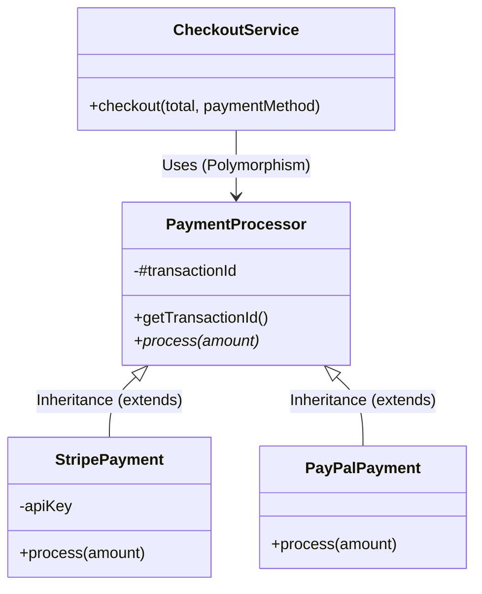

# قوانین بسیار مهم درباره JavaScript

این قوانین را در تمام محتوا رعایت کن:

1. **JavaScript را یک زبان Prototype-based معرفی کن.**
2. توضیح بده که `class` در JavaScript یک Syntax و Abstraction روی Prototypeهاست، نه اینکه Prototype را کاملاً حذف کرده باشد.
3. از اصطلاحات C# مانند `public`، `private`، `protected` و `internal` به‌صورت مستقیم استفاده نکن؛ مگر اینکه تفاوت آن‌ها با JavaScript را توضیح بدهی.
4. در JavaScript، `#privateField` را از `_privateField` متمایز کن.
5. توضیح بده که `_name` فقط یک قرارداد نام‌گذاری است و به‌خودی‌خود خصوصی نیست.
6. توضیح بده که JavaScript به‌صورت Native از Method Overloading مانند C# پشتیبانی نمی‌کند.
7. Polymorphism را فقط به Inheritance محدود نکن.
8. تفاوت `this`، `prototype`، `[[Prototype]]` و `class` را به‌صورت تدریجی توضیح بده.
9. از مثال‌های قابل‌اجرا در JavaScript مدرن استفاده کن.
10. در مثال‌ها از `const` و `let` استفاده کن و از `var` فقط در بخش مقایسه یا توضیح تاریخی استفاده کن.
11. از ویژگی‌های مدرن JavaScript مانند Private Fields، Static Fields و Class Fields در بخش مناسب استفاده کن.
12. هرجا رفتاری به نسخه JavaScript یا پشتیبانی محیط اجرا وابسته است، آن را با منبع معتبر بررسی و مشخص کن.

---

# زبان و سبک نوشتار

* زبان اصلی: **فارسی**
* اصطلاحات تخصصی انگلیسی را در کنار معادل فارسی بنویس.
* لحن آموزشی، ساده، روان و حرفه‌ای باشد.
* فرض کن خواننده مبتدی است.
* ابتدا مفهوم را با زبان ساده توضیح بده، سپس وارد جزئیات فنی شو.
* هر مفهوم را با مثال واقعی و سپس مثال کدنویسی توضیح بده.
* از توضیحات پیچیده و غیرضروری در ابتدای هر موضوع خودداری کن.
* از پاراگراف‌های کوتاه و Headingهای منظم استفاده کن.
* از جدول فقط زمانی استفاده کن که برای مقایسه مفید باشد.
* از تکرار بی‌دلیل مطالب خودداری کن.
* کدها باید خوانا، استاندارد و قابل‌اجرا باشند.
* در صورت امکان، خروجی کد را نیز نشان بده.
* اگر یک مفهوم با مثال ساده قابل‌فهم‌تر است، ابتدا همان مثال را ارائه بده.

---

# ساختار کلی خروجی

خروجی باید یک فایل Markdown کامل و مناسب ریپوزیتوری GitHub باشد.

در ابتدای فایل:

* عنوان اصلی
* توضیح کوتاه
* پیش‌نیازهای یادگیری
* فهرست مطالب

قرار بده.

ساختار پیشنهادی:

```markdown
# Object-Oriented Programming (OOP) in JavaScript

توضیح کوتاه درباره این بخش

## Prerequisites

- JavaScript Basics
- Variables
- Functions
- Objects
- Arrays
- `this`
- Scope

## Table of Contents

- [1. مقدمه‌ای بر OOP](#1-مقدمه‌ای-بر-oop)
- [2. Object در JavaScript](#2-object-در-javascript)
- [3. Class در JavaScript](#3-class-در-javascript)
- [4. Prototype و Prototype Chain](#4-prototype-و-prototype-chain)
- [5. Encapsulation](#5-encapsulation)
- [6. Abstraction](#6-abstraction)
- [7. Inheritance](#7-inheritance)
- [8. Polymorphism](#8-polymorphism)
- [9. ارتباط مفاهیم OOP](#9-ارتباط-مفاهیم-oop)
- [10. Composition در برابر Inheritance](#10-composition-در-برابر-inheritance)
- [11. اشتباهات رایج](#11-اشتباهات-رایج)
- [12. مباحث پیشرفته](#12-مباحث-پیشرفته)
- [13. تمرین‌ها](#13-تمرینها)
- [14. جمع‌بندی](#14-جمع‌بندی)
- [15. منابع](#15-منابع)
```

**نکته:** لینک‌های فهرست مطالب باید با Headingهای واقعی Markdown سازگار باشند. اگر لازم است برای سازگاری GitHub، Headingها را به شکلی بنویس که لینک‌دهی آن‌ها معتبر باشد.

---

# بخش اول: مقدمه‌ای بر OOP

## 1.1 برنامه‌نویسی شیءگرا چیست؟

توضیح بده:

* OOP چیست؟
* چرا به وجود آمد؟
* چه مشکلی را در برنامه‌های بزرگ حل می‌کند؟
* تفاوت کلی برنامه‌نویسی رویه‌ای (Procedural) و شیءگرا چیست؟
* Object چیست؟
* State و Behavior چه هستند؟
* چگونه داده و رفتار در یک Object کنار هم قرار می‌گیرند؟

مثال‌های واقعی:

* خودرو
* حساب بانکی
* کاربر
* سفارش فروشگاه
* پخش‌کننده موسیقی

مثال ساده JavaScript:

```javascript
const car = {
  color: "white",

  start() {
    console.log("Car started.");
  }
};

car.start();
```

توضیح بده:

* State چیست؟
* Behavior چیست؟
* Object چگونه داده و رفتار را نگهداری می‌کند؟
* چرا این مثال هنوز از Class استفاده نمی‌کند؟

---

## 1.2 چهار اصل اصلی OOP

چهار اصل اصلی را معرفی کن:

* Encapsulation
* Abstraction
* Inheritance
* Polymorphism

برای هرکدام:

* تعریف ساده
* هدف
* مثال واقعی
* یک جمله کلیدی برای به‌خاطر سپردن

در این بخش وارد جزئیات سنگین نشو؛ جزئیات را در فصل‌های بعدی توضیح بده.

---

## 1.3 آیا JavaScript واقعاً شیءگراست؟

توضیح بده:

* JavaScript چه نوع زبانی است؟
* Prototype-based یعنی چه؟
* آیا JavaScript فقط شیءگراست؟
* آیا می‌توان با JavaScript به روش Functional یا Procedural نیز برنامه نوشت؟
* چرا JavaScript را Multi-paradigm می‌دانند؟
* تفاوت JavaScript با زبان‌های Class-based مانند C# و Java چیست؟

تأکید کن که JavaScript از چند سبک برنامه‌نویسی پشتیبانی می‌کند و OOP یکی از آن‌هاست.

---

# بخش دوم: Object در JavaScript

## 2.1 Object چیست؟

توضیح بده:

* Object چیست؟
* Property چیست؟
* Method چیست؟
* Key و Value چه هستند؟
* Object چگونه ساخته می‌شود؟
* تفاوت Object Literal و Object ساخته‌شده با Constructor چیست؟

مثال:

```javascript
const person = {
  name: "Ali",
  age: 25,

  sayHello() {
    console.log(`Hello, I am ${this.name}`);
  }
};
```

خط‌به‌خط توضیح بده.

---

## 2.2 روش‌های ساخت Object

توضیح بده:

* Object Literal
* `new Object()`
* Constructor Function
* `Object.create()`
* Class

برای هر روش:

* مثال
* کاربرد
* مزایا
* محدودیت‌ها
* سطح دشواری

---

## 2.3 State و Behavior

توضیح بده:

* State چیست؟
* Behavior چیست؟
* چرا بهتر است رفتار مرتبط با داده کنار همان Object قرار بگیرد؟
* چه زمانی Object فقط داده است و چه زمانی رفتار نیز دارد؟

مثال ساده از `BankAccount` ارائه بده.

---

# بخش سوم: Class در JavaScript

## 3.1 Class چیست؟

توضیح بده:

* Class چیست؟
* چرا به آن Blueprint یا قالب ساخت Object می‌گویند؟
* تفاوت Class و Object چیست؟
* Class چه چیزهایی را تعریف می‌کند؟
* `new` چه کاری انجام می‌دهد؟
* چرا Class در JavaScript با Class در C# یکسان نیست؟

مثال:

```javascript
class Person {
  constructor(name) {
    this.name = name;
  }

  sayHello() {
    console.log(`Hello, I am ${this.name}`);
  }
}

const person = new Person("Ali");

person.sayHello();
```

خط‌به‌خط توضیح بده.

---

## 3.2 اجزای Class در JavaScript

توضیح بده:

* Class Declaration
* Class Expression
* Constructor
* Instance Fields
* Instance Methods
* Getters
* Setters
* Static Methods
* Static Fields
* Private Fields
* Private Methods

برای هر مورد:

* تعریف ساده
* کاربرد
* مثال کوتاه
* نکته مهم

---

## 3.3 Constructor

توضیح بده:

* Constructor چیست؟
* چه زمانی اجرا می‌شود؟
* تفاوت Constructor و Method چیست؟
* آیا Constructor در JavaScript اجباری است؟
* Constructor پیش‌فرض چیست؟
* Constructor در Class فرزند چگونه کار می‌کند؟

مثال:

```javascript
class BankAccount {
  constructor(owner, initialBalance) {
    this.owner = owner;
    this.balance = initialBalance;
  }
}
```

---

## 3.4 Instance و Static

توضیح بده:

* Instance Member چیست؟
* Static Member چیست؟
* تفاوت آن‌ها چیست؟
* چرا متدهای Static روی Objectهای ساخته‌شده در دسترس نیستند؟
* چه زمانی از Static استفاده کنیم؟

مثال:

```javascript
class MathHelper {
  static add(a, b) {
    return a + b;
  }
}

console.log(MathHelper.add(2, 3));
```

---

## 3.5 Class Fields

توضیح بده:

* Public Instance Fields
* Private Instance Fields
* Static Fields
* تفاوت تعریف Field در Constructor و بدنه Class
* مقداردهی اولیه Fieldها

مثال:

```javascript
class User {
  role = "user";
  #password = "secret";
}
```

---

## 3.6 Getters و Setters

توضیح بده:

* Getter چیست؟
* Setter چیست؟
* چه تفاوتی با Method دارند؟
* چه زمانی استفاده از Getter و Setter مناسب است؟
* آیا Getter و Setter همیشه باعث Encapsulation می‌شوند؟

مثال:

```javascript
class Temperature {
  constructor(celsius) {
    this._celsius = celsius;
  }

  get celsius() {
    return this._celsius;
  }

  set celsius(value) {
    if (value < -273.15) {
      throw new Error("Temperature cannot be below absolute zero.");
    }

    this._celsius = value;
  }
}
```

توضیح بده که `_celsius` در این مثال واقعاً Private نیست.

---

## 3.7 مباحث پیشرفته Class

توضیح بده:

* Class Expression
* Computed Method Names
* Static Initialization Blocks
* Private Static Fields
* Private Methods
* `instanceof`
* `new.target`
* Class Constructor
* تفاوت Class و Constructor Function

برای هر مورد مشخص کن که آیا برای مبتدی ضروری است یا مبحث پیشرفته محسوب می‌شود.

---

# بخش چهارم: Prototype و Prototype Chain

## 4.1 Prototype چیست؟

توضیح بده:

* Prototype چیست؟
* چرا JavaScript را Prototype-based می‌دانند؟
* Prototype چه نقشی در Objectها دارد؟
* تفاوت `prototype` و `[[Prototype]]` چیست؟
* تفاوت `__proto__` و `Object.getPrototypeOf()` چیست؟
* چرا بهتر است برای دسترسی به Prototype از APIهای استاندارد استفاده کنیم؟

مثال:

```javascript
const person = {
  name: "Ali"
};

console.log(Object.getPrototypeOf(person));
```

---

## 4.2 Prototype Chain

توضیح بده:

* Prototype Chain چیست؟
* JavaScript هنگام دسترسی به Property چگونه جست‌وجو می‌کند؟
* اگر Property در Object پیدا نشود چه اتفاقی می‌افتد؟
* `Object.prototype` چیست؟
* `null` چه نقشی در انتهای زنجیره دارد؟

مثال ساده و قابل‌اجرا ارائه بده.

---

## 4.3 Constructor Function و Prototype

توضیح بده:

* Constructor Function چیست؟
* چگونه قبل از معرفی Classها از آن استفاده می‌شد؟
* نقش `prototype` در Constructor Function چیست؟
* چرا متدها معمولاً روی Prototype قرار می‌گیرند؟

مثال:

```javascript
function Person(name) {
  this.name = name;
}

Person.prototype.sayHello = function () {
  console.log(`Hello, I am ${this.name}`);
};

const person = new Person("Ali");

person.sayHello();
```

---

## 4.4 ارتباط Class و Prototype

توضیح بده:

* متدهای Instance در Class کجا قرار می‌گیرند؟
* چرا دو Object ساخته‌شده از یک Class می‌توانند از یک متد مشترک استفاده کنند؟
* Class چگونه Prototype Chain ایجاد می‌کند؟
* چه تفاوتی میان ظاهر Class و مکانیزم داخلی آن وجود دارد؟

مثال مقایسه‌ای بین Class و Constructor Function ارائه بده.

---

## 4.5 مباحث پیشرفته Prototype

توضیح بده:

* `Object.create()`
* `Object.getPrototypeOf()`
* `Object.setPrototypeOf()`
* `Object.prototype`
* Property Lookup
* Shadowing
* Prototype Pollution
* تغییر Prototype در Runtime
* چرا تغییر Prototype در Runtime معمولاً توصیه نمی‌شود؟

مثال‌ها باید ساده و همراه با هشدارهای لازم باشند.

---

# بخش پنجم: Encapsulation

## 5.1 Encapsulation چیست؟

توضیح بده:

* Encapsulation به زبان ساده چیست؟
* چرا به آن کپسوله‌سازی می‌گویند؟
* منظور از مخفی‌کردن جزئیات داخلی چیست؟
* چرا نباید هر بخش از برنامه مستقیماً به داده‌های داخلی دسترسی داشته باشد؟
* Encapsulation چگونه از Invalid State جلوگیری می‌کند؟
* آیا Encapsulation فقط مخفی‌کردن داده است؟

مثال واقعی:

* حساب بانکی
* دستگاه خودپرداز
* سفارش فروشگاه
* سیستم مدیریت موجودی

---

## 5.2 Encapsulation در JavaScript

روش‌های مختلف را توضیح بده:

* Convention با `_`
* Closure
* Factory Function
* `WeakMap`
* Private Fields با `#`
* Private Methods
* Getters و Setters
* Module Scope

برای هر روش:

* تعریف ساده
* مثال
* میزان واقعی‌بودن Privacy
* مزایا
* محدودیت‌ها
* زمان مناسب استفاده

---

## 5.3 مثال بد و مثال خوب

ابتدا:

```javascript
class BankAccount {
  constructor() {
    this.balance = 0;
  }
}
```

توضیح بده چرا هر کدی می‌تواند موجودی را مستقیماً تغییر دهد.

سپس نسخه بهتر:

```javascript
class BankAccount {
  #balance = 0;

  deposit(amount) {
    if (amount <= 0) {
      throw new Error("Amount must be positive.");
    }

    this.#balance += amount;
  }

  getBalance() {
    return this.#balance;
  }
}
```

توضیح بده:

* چرا `#balance` استفاده شده؟
* چرا تغییر موجودی از طریق Method انجام می‌شود؟
* چرا `_balance` با `#balance` متفاوت است؟
* آیا Private Field از بیرون قابل‌دسترسی است؟

---

## 5.4 Encapsulation با Closure

مثال:

```javascript
function createBankAccount(initialBalance = 0) {
  let balance = initialBalance;

  return {
    deposit(amount) {
      if (amount <= 0) {
        throw new Error("Amount must be positive.");
      }

      balance += amount;
    },

    getBalance() {
      return balance;
    }
  };
}
```

توضیح بده:

* چرا `balance` از بیرون قابل‌دسترسی نیست؟
* Closure چه نقشی دارد؟
* تفاوت این روش با Class و Private Field چیست؟

---

## 5.5 Encapsulation و Properties

توضیح بده:

* Getter
* Setter
* Backing Field
* Validation
* Read-only Property
* Private Setter در JavaScript چه جایگزین‌هایی دارد؟
* تفاوت `Object.freeze()` با Encapsulation
* چرا `Object.freeze()` جایگزین Private Field نیست؟

---

## 5.6 Encapsulation در سطح پیشرفته

توضیح بده:

* Information Hiding
* Invariant چیست؟
* چرا Encapsulation فقط `#` نیست؟
* Encapsulation در Domain Model
* Encapsulation در طراحی API
* Encapsulation و جلوگیری از تغییرات نامعتبر
* تفاوت Encapsulation با Data Hiding
* تفاوت Encapsulation با Abstraction

---

## 5.7 اشتباهات رایج در Encapsulation

موارد زیر را با مثال توضیح بده:

* عمومی‌کردن تمام داده‌ها
* استفاده از `_private` به‌عنوان Private واقعی
* استفاده بی‌دلیل از Getter و Setter
* قرار دادن منطق اعتبارسنجی خارج از Object
* تصور اینکه `Object.freeze()` همه‌چیز را خصوصی می‌کند
* تصور اینکه Encapsulation فقط مخفی‌کردن فیلدهاست

---

# بخش ششم: Abstraction

## 6.1 Abstraction چیست؟

توضیح بده:

* Abstraction به زبان ساده چیست؟
* چرا جزئیات غیرضروری را پنهان می‌کنیم؟
* چگونه فقط رفتارهای مهم را در اختیار مصرف‌کننده قرار می‌دهیم؟
* تفاوت Abstraction با Encapsulation چیست؟

مثال واقعی:

* رانندگی خودرو بدون دانستن جزئیات موتور
* استفاده از دستگاه خودپرداز
* ارسال ایمیل بدون دانستن جزئیات شبکه
* استفاده از `Array.map()`

---

## 6.2 Abstraction در JavaScript

توضیح بده:

* آیا JavaScript کلمه کلیدی `abstract` دارد؟
* چگونه با Class و Method می‌توان Abstraction ایجاد کرد؟
* چگونه با Interface-like Contract می‌توان Abstraction ایجاد کرد؟
* چگونه با Factory Function می‌توان جزئیات پیاده‌سازی را پنهان کرد؟
* چگونه با Module می‌توان API عمومی و جزئیات داخلی را جدا کرد؟

مثال:

```javascript
class NotificationService {
  send(message) {
    throw new Error("send() must be implemented.");
  }
}
```

توضیح بده که این فقط یک قرارداد دستی است و مانند Abstract Class واقعی در C# نیست.

---

## 6.3 Abstraction با Interface-like Contract

توضیح بده:

* Interface در JavaScript به‌صورت Native مانند C# وجود ندارد.
* چگونه می‌توان یک Contract ایجاد کرد؟
* Duck Typing چیست؟
* چه زمانی داشتن یک متد مشترک کافی است؟

مثال:

```javascript
function sendNotification(service, message) {
  service.send(message);
}
```

سپس چند پیاده‌سازی ارائه بده:

```javascript
const emailService = {
  send(message) {
    console.log(`Email: ${message}`);
  }
};

const smsService = {
  send(message) {
    console.log(`SMS: ${message}`);
  }
};
```

---

## 6.4 Abstraction با Factory Function

مثال:

```javascript
function createNotificationService() {
  function validateMessage(message) {
    if (!message) {
      throw new Error("Message is required.");
    }
  }

  return {
    send(message) {
      validateMessage(message);
      console.log(`Sending: ${message}`);
    }
  };
}
```

توضیح بده:

* چه چیزی در اختیار مصرف‌کننده قرار گرفته؟
* چه چیزی پنهان شده؟
* چرا این Abstraction محسوب می‌شود؟

---

## 6.5 Abstract Class در برابر Interface-like Contract

یک مقایسه ساده ارائه بده.

موارد مقایسه:

* هدف
* Implementation
* State
* Contract
* Inheritance
* Duck Typing
* Coupling
* کاربرد در پروژه‌های واقعی

تأکید کن که JavaScript مانند C# از `interface` و `abstract` به همان شکل پشتیبانی نمی‌کند.

---

## 6.6 مباحث پیشرفته Abstraction

توضیح بده:

* Dependency Inversion در JavaScript
* Dependency Injection
* Programming to a Contract
* Loose Coupling
* Abstraction در Moduleها
* Abstraction در معماری پروژه
* Abstraction در Frontend و Backend
* Abstraction بیش‌ازحد
* تفاوت Abstraction خوب و Abstraction ضعیف

مثال ساده از Service و Dependency Injection ارائه بده.

---

# بخش هفتم: Inheritance

## 7.1 Inheritance چیست؟

توضیح بده:

* Inheritance به زبان ساده چیست؟
* چرا از آن استفاده می‌کنیم؟
* Base Class چیست؟
* Derived Class چیست؟
* رابطه `is-a` چیست؟
* Inheritance در JavaScript چگونه با Prototype کار می‌کند؟

مثال واقعی:

* Animal → Dog
* Vehicle → Car
* Employee → Manager

مثال JavaScript:

```javascript
class Animal {
  constructor(name) {
    this.name = name;
  }

  eat() {
    console.log(`${this.name} is eating.`);
  }
}

class Dog extends Animal {
  bark() {
    console.log("Dog is barking.");
  }
}
```

نحوه استفاده را نشان بده.

---

## 7.2 Inheritance با Prototype

مثال ساده با `Object.create()` ارائه بده.

توضیح بده:

* چگونه یک Object می‌تواند از Prototype Object دیگری استفاده کند؟
* چرا این نوع Inheritance با Class Syntax متفاوت به نظر می‌رسد؟
* ارتباط Prototype Chain و Inheritance چیست؟

---

## 7.3 Inheritance با `extends`

توضیح بده:

* `extends` چیست؟
* `super()` چیست؟
* `super.method()` چیست؟
* Class فرزند چگونه از Class والد استفاده می‌کند؟
* آیا JavaScript از Multiple Inheritance بین Classها پشتیبانی می‌کند؟
* چرا هر Class فقط می‌تواند از یک Class دیگر `extends` کند؟

مثال:

```javascript
class Animal {
  speak() {
    console.log("Animal sound");
  }
}

class Dog extends Animal {
  speak() {
    super.speak();
    console.log("Bark");
  }
}
```

---

## 7.4 Constructor و Inheritance

توضیح بده:

* ترتیب اجرای Constructorها
* نقش `super()`
* چرا در Derived Class قبل از استفاده از `this` باید `super()` اجرا شود؟
* ارسال پارامتر به Base Class
* تفاوت `super` و `this`

مثال کامل ارائه بده.

---

## 7.5 Method Overriding

توضیح بده:

* Override چیست؟
* چگونه متد کلاس والد را در کلاس فرزند بازنویسی می‌کنیم؟
* تفاوت Override با Method Hiding در JavaScript
* آیا JavaScript کلمه کلیدی `override` دارد؟
* چرا نام متد مهم است؟

مثال:

```javascript
class Animal {
  speak() {
    console.log("Animal sound");
  }
}

class Dog extends Animal {
  speak() {
    console.log("Bark");
  }
}
```

---

## 7.6 `instanceof`

توضیح بده:

* `instanceof` چیست؟
* چگونه رابطه Prototype Chain را بررسی می‌کند؟
* چه تفاوتی با بررسی نوع داده دارد؟
* چه محدودیت‌هایی دارد؟

مثال:

```javascript
const dog = new Dog();

console.log(dog instanceof Dog);
console.log(dog instanceof Animal);
```

---

## 7.7 Inheritance در طراحی واقعی

توضیح بده:

* چه زمانی Inheritance انتخاب مناسبی است؟
* چه زمانی Composition بهتر است؟
* رابطه `is-a` در برابر `has-a`
* مشکل Deep Inheritance Hierarchy
* مشکل Fragile Base Class
* چرا Inheritance نباید فقط برای Reuse کد استفاده شود؟
* ارتباط Inheritance با Liskov Substitution Principle

مثال Composition:

```javascript
class Engine {
  start() {
    console.log("Engine started.");
  }
}

class Car {
  constructor() {
    this.engine = new Engine();
  }

  start() {
    this.engine.start();
  }
}
```

توضیح بده چرا این مثال Composition است.

---

# بخش هشتم: Polymorphism

## 8.1 Polymorphism چیست؟

توضیح بده:

* معنی Polymorphism
* چرا به آن چندریختی می‌گویند؟
* چگونه یک قرارداد یا نوع پایه می‌تواند رفتارهای متفاوت داشته باشد؟
* چرا Polymorphism فقط مخصوص Class نیست؟
* تفاوت Polymorphism در JavaScript و C# چیست؟

مثال واقعی:

* روش‌های مختلف پرداخت
* انواع Notification
* حیوانات با صداهای متفاوت
* Shapeهای مختلف با محاسبه مساحت متفاوت

---

## 8.2 Polymorphism با Inheritance

مثال کامل:

```javascript
class Payment {
  pay(amount) {
    throw new Error("pay() must be implemented.");
  }
}

class CardPayment extends Payment {
  pay(amount) {
    console.log(`Paid ${amount} by card.`);
  }
}

class CashPayment extends Payment {
  pay(amount) {
    console.log(`Paid ${amount} by cash.`);
  }
}
```

سپس:

```javascript
function processPayment(payment, amount) {
  payment.pay(amount);
}

processPayment(new CardPayment(), 100);
processPayment(new CashPayment(), 100);
```

توضیح بده:

* چگونه یک Function با انواع مختلف Object کار می‌کند؟
* چرا لازم نیست داخل `processPayment` نوع Object را بررسی کنیم؟
* نقش Contract چیست؟

---

## 8.3 Polymorphism با Duck Typing

توضیح بده:

* Duck Typing چیست؟
* چرا در JavaScript مهم است؟
* چگونه بدون Inheritance می‌توان رفتار مشترک داشت؟
* تفاوت Duck Typing و Type Checking چیست؟

مثال:

```javascript
const emailService = {
  send(message) {
    console.log(`Email: ${message}`);
  }
};

const smsService = {
  send(message) {
    console.log(`SMS: ${message}`);
  }
};

function notify(service, message) {
  service.send(message);
}
```

---

## 8.4 Polymorphism با Interface-like Contract

توضیح بده:

* چگونه چند Object می‌توانند یک Contract مشترک داشته باشند؟
* چرا JavaScript به‌جای Interface رسمی، اغلب از قرارداد رفتاری استفاده می‌کند؟
* مزایا و محدودیت‌های این روش چیست؟

---

## 8.5 Compile-Time و Runtime Polymorphism

توضیح بده:

* Runtime Polymorphism چیست؟
* آیا JavaScript Compile-Time Polymorphism مانند C# دارد؟
* Method Overloading در JavaScript چگونه شبیه‌سازی می‌شود؟
* تفاوت Overloading و Overriding چیست؟
* چرا در JavaScript چند متد هم‌نام در یک Class، Overloading واقعی ایجاد نمی‌کنند؟

مثال:

```javascript
class Calculator {
  add(a, b, c) {
    if (c === undefined) {
      return a + b;
    }

    return a + b + c;
  }
}
```

توضیح بده که این Overloading واقعی نیست، بلکه مدیریت دستی آرگومان‌هاست.

---

## 8.6 Polymorphism و Prototype

توضیح بده:

* Method Lookup چگونه به Polymorphism کمک می‌کند؟
* Override در Prototype Chain چگونه کار می‌کند؟
* نقش `this` در اجرای متد چیست؟
* تفاوت Static Dispatch و Dynamic Dispatch در حد مناسب برای JavaScript

---

## 8.7 مباحث پیشرفته Polymorphism

توضیح بده:

* Structural Typing در JavaScript
* Duck Typing
* Method Overriding
* `instanceof`
* `Symbol.hasInstance`
* Polymorphism در Dependency Injection
* Polymorphism در طراحی Serviceها
* Polymorphism در Serialization و JSON
* Polymorphism با Composition
* Polymorphism در Design Patterns

---

## 8.8 اشتباهات رایج در Polymorphism

توضیح بده:

* استفاده نادرست از `instanceof`
* استفاده از `if/else`های زیاد به جای Polymorphism
* ایجاد Hierarchy پیچیده
* اشتباه گرفتن Overloading با Overriding
* استفاده از Polymorphism بدون نیاز واقعی
* وابستگی شدید به نوع واقعی Object

---

# بخش نهم: ارتباط مفاهیم OOP

یک مثال نسبتاً واقعی طراحی کن؛ مثلاً سیستم پرداخت، فروشگاه یا سیستم Notification.

در این مثال نشان بده:

* Object چگونه استفاده می‌شود؟
* Class چگونه طراحی می‌شود؟
* Encapsulation کجا قرار دارد؟
* Abstraction چگونه ایجاد می‌شود؟
* Inheritance چه نقشی دارد؟
* Polymorphism چگونه رفتارهای متفاوت را مدیریت می‌کند؟
* Prototype در پشت Class چه نقشی دارد؟

مثال باید مرحله‌به‌مرحله ساخته شود.

در پایان، یک دیاگرام ساده Mermaid برای ارتباط مفاهیم ارائه بده.

---

# بخش دهم: Composition در برابر Inheritance

## 10.1 Composition چیست؟

توضیح بده:

* Composition چیست؟
* رابطه `has-a` چیست؟
* چرا Composition می‌تواند انعطاف‌پذیرتر باشد؟
* تفاوت Composition و Inheritance چیست؟

مثال:

```javascript
class Engine {
  start() {
    console.log("Engine started.");
  }
}

class Car {
  constructor(engine) {
    this.engine = engine;
  }

  start() {
    this.engine.start();
  }
}
```

---

## 10.2 چه زمانی Composition بهتر است؟

توضیح بده:

* وقتی رفتارها قابل‌تعویض هستند.
* وقتی نمی‌خواهیم Hierarchy عمیق بسازیم.
* وقتی چند Object رفتارهای مشترک دارند اما رابطه `is-a` ندارند.
* وقتی می‌خواهیم وابستگی‌ها را راحت‌تر تست کنیم.

مثال مقایسه‌ای ارائه بده.

---

# بخش یازدهم: اشتباهات رایج در طراحی شیءگرا

موارد زیر را با مثال توضیح بده:

* God Object
* کلاس‌های بیش‌ازحد بزرگ
* Inheritance بی‌دلیل
* استفاده بیش‌ازحد از Class
* Abstraction بیش‌ازحد
* Public کردن همه داده‌ها
* استفاده از `_private` به‌عنوان Privacy واقعی
* وابستگی شدید بین Objectها
* نقض Single Responsibility Principle
* نقض Liskov Substitution Principle
* استفاده نادرست از Static
* ساختن Objectهای نامعتبر
* مخلوط‌کردن منطق کسب‌وکار با جزئیات زیرساخت
* تغییر مستقیم Prototypeهای Built-in

برای هر مورد:

* مشکل چیست؟
* چرا بد است؟
* مثال ساده
* راهکار بهتر

---

# بخش دوازدهم: مباحث پیشرفته

این بخش را به‌صورت مقدماتی و قابل‌فهم معرفی کن.

موضوعات:

* SOLID Principles
* Composition over Inheritance
* Dependency Injection
* Dependency Inversion
* Liskov Substitution Principle
* Open/Closed Principle
* Single Responsibility Principle
* Interface Segregation Principle
* Coupling و Cohesion
* Immutability
* Rich Domain Model
* Anemic Domain Model
* Design Patterns مرتبط با OOP
* Strategy Pattern
* Factory Pattern
* Adapter Pattern
* Decorator Pattern
* Module Pattern
* Mixins
* Closures در طراحی شیءگرا
* Prototype Chain در سطح پیشرفته
* Private Fields و Private Methods
* Static Initialization Blocks

برای هر موضوع:

* تعریف ساده
* ارتباط با OOP
* مثال کوتاه
* کاربرد واقعی
* سطح دشواری
* پیش‌نیاز یادگیری

---

# بخش سیزدهم: تمرین‌ها

برای هر موضوع حداقل ۳ تمرین طراحی کن.

## تمرین‌های Object و Class

* ساخت کلاس Student
* ساخت کلاس Product
* ساخت کلاس BankAccount

## تمرین‌های Encapsulation

* حساب بانکی با جلوگیری از موجودی منفی
* محصول با قیمت معتبر
* سفارش با وضعیت کنترل‌شده
* پیاده‌سازی با Private Field
* پیاده‌سازی با Closure

## تمرین‌های Abstraction

* سیستم ارسال Notification
* سیستم پرداخت
* سیستم ذخیره‌سازی فایل
* طراحی یک Service با Contract رفتاری

## تمرین‌های Inheritance

* Animal و Dog
* Employee و Manager
* Vehicle و Car
* پیاده‌سازی با `extends`
* پیاده‌سازی ساده با Prototype

## تمرین‌های Polymorphism

* محاسبه مساحت Shapeهای مختلف
* پرداخت با روش‌های مختلف
* ارسال Notification با کانال‌های مختلف
* Duck Typing
* Polymorphism با Composition

برای هر تمرین:

* صورت مسئله
* مفاهیم مورد استفاده
* سطح دشواری
* نکته یا راهنمایی کوتاه

در صورت نیاز، پاسخ تمرین‌ها را در بخش جداگانه قرار بده؛ اما ابتدا اجازه بده خواننده خودش تلاش کند.

---

# بخش چهاردهم: جمع‌بندی

در پایان:

* خلاصه‌ای از تمام مفاهیم ارائه بده.
* تفاوت Object و Class را یادآوری کن.
* تفاوت Encapsulation و Abstraction را توضیح بده.
* تفاوت Inheritance و Composition را بیان کن.
* تفاوت Overloading و Overriding را توضیح بده.
* ارتباط چهار اصل OOP را در چند جمله جمع‌بندی کن.
* نقش Prototype در JavaScript را یادآوری کن.
* یک مسیر پیشنهادی برای ادامه یادگیری JavaScript ارائه بده.

---

# بخش پانزدهم: منابع

در پایان، منابع معتبر و رسمی را معرفی کن.

منابع اصلی پیشنهادی:

1. **MDN — Classes**

   * https://developer.mozilla.org/en-US/docs/Web/JavaScript/Reference/Classes

2. **MDN — Using Classes**

   * https://developer.mozilla.org/en-US/docs/Web/JavaScript/Guide/Using_classes

3. **MDN — Inheritance and the Prototype Chain**

   * https://developer.mozilla.org/en-US/docs/Web/JavaScript/Guide/Inheritance_and_the_prototype_chain

4. **MDN — Private Elements**

   * https://developer.mozilla.org/en-US/docs/Web/JavaScript/Reference/Classes/Private_elements

5. **MDN — JavaScript Guide**

   * https://developer.mozilla.org/en-US/docs/Web/JavaScript/Guide

6. **MDN — Object**

   * https://developer.mozilla.org/en-US/docs/Web/JavaScript/Reference/Global_Objects/Object

7. **MDN — `Object.create()`**

   * https://developer.mozilla.org/en-US/docs/Web/JavaScript/Reference/Global_Objects/Object/create

8. **MDN — `instanceof`**

   * https://developer.mozilla.org/en-US/docs/Web/JavaScript/Reference/Operators/instanceof

9. **MDN — Classes: Private Elements**

   * https://developer.mozilla.org/en-US/docs/Web/JavaScript/Reference/Classes/Private_elements

10. **JavaScript.info — Classes**

    * https://javascript.info/classes

11. **JavaScript.info — Prototypes**

    * https://javascript.info/prototypes

12. **JavaScript.info — Class Inheritance**

    * https://javascript.info/class-inheritance

13. **ECMAScript Language Specification**

    * https://tc39.es/ecma262/

**قوانین منابع:**

* از منابع رسمی و معتبر استفاده کن.
* منابع اصلی را ترجیحاً از MDN و ECMAScript انتخاب کن.
* برای توضیحات آموزشی تکمیلی می‌توانی از JavaScript.info استفاده کنی.
* اگر مطلبی از منبعی برداشت می‌کنی، آن را با زبان خودت توضیح بده و کپی طولانی نکن.
* لینک منابع را بررسی کن و از لینک‌های معتبر استفاده کن.
* در پایان مشخص کن هر منبع برای کدام بخش استفاده شده است.
* اگر یک قابلیت JavaScript به نسخه خاصی وابسته است، نسخه یا وضعیت پشتیبانی آن را بررسی کن.
* از منابع نامعتبر، وبلاگ‌های بدون اعتبار و مطالب بدون تاریخ یا نویسنده مشخص استفاده نکن؛ مگر اینکه صرفاً برای مثال آموزشی باشد.

---

# فرمت نهایی خروجی

خروجی را به‌صورت یک فایل Markdown کامل ارائه بده.

ویژگی‌های خروجی:

* دارای فهرست مطالب
* دارای لینک‌دهی معتبر
* دارای Headingهای منظم
* دارای مثال‌های JavaScript
* دارای توضیح خط‌به‌خط کدهای مهم
* دارای مثال واقعی
* دارای مقایسه‌های ضروری
* دارای تمرین
* دارای جمع‌بندی
* دارای منابع معتبر در پایان
* مناسب برای مبتدی
* قابل‌استفاده در GitHub
* بدون پیچیده‌گویی غیرضروری

**مهم:** مطالب را از مقدماتی شروع کن و به‌صورت تدریجی به مباحث پیشرفته برس. هیچ مفهوم مهمی را بدون توضیح قبلی معرفی نکن.


### ASSISTANT
# Object-Oriented Programming (OOP) in JavaScript

این سند آموزشی جامع، مفاهیم برنامه‌نویسی شیءگرا (OOP) را به‌صورت گام‌به‌گام و با تمرکز بر ویژگی‌های منحصربه‌فرد JavaScript توضیح می‌دهد. هدف این است که حتی اگر تازه‌کار هستید، درک عمیقی از نحوه مدل‌سازی داده‌ها و رفتارها در JavaScript پیدا کنید و از الگوهای طراحی مدرن و استاندارد استفاده نمایید.

## Prerequisites (پیش‌نیازهای یادگیری)

برای بهره‌برداری حداکثری از این محتوا، آشنایی مقدماتی با موارد زیر توصیه می‌شود:
- مبانی JavaScript (متغیرها، توابع، حلقه‌ها)
- کار با Objectها و Arrayها به‌صورت مقدماتی
- مفهوم `this` و Scope (حوزه دسترسی) در JavaScript
- آشنایی اولیه با مفهوم ماژول‌ها (ES Modules)

## Table of Contents (فهرست مطالب)

- [1. مقدمه‌ای بر OOP](#1-مقدمه‌ای-بر-oop)
- [2. Object در JavaScript](#2-object-در-javascript)
- [3. Class در JavaScript](#3-class-در-javascript)
- [4. Prototype و Prototype Chain](#4-prototype-و-prototype-chain)
- [5. Encapsulation](#5-encapsulation)
- [6. Abstraction](#6-abstraction)
- [7. Inheritance](#7-inheritance)
- [8. Polymorphism](#8-polymorphism)
- [9. ارتباط مفاهیم OOP](#9-ارتباط-مفاهیم-oop)
- [10. Composition در برابر Inheritance](#10-composition-در-برابر-inheritance)
- [11. اشتباهات رایج در طراحی شیءگرا](#11-اشتباهات-رایج-در-طراحی-شیءگرا)
- [12. مباحث پیشرفته](#12-مباحث-پیشرفته)
- [13. تمرین‌ها](#13-تمرین‌ها)
- [14. جمع‌بندی](#14-جمع‌بندی)
- [15. منابع](#15-منابع)

---

## 1. مقدمه‌ای بر OOP

### 1.1 برنامه‌نویسی شیءگرا چیست؟
برنامه‌نویسی شیءگرا (Object-Oriented Programming یا OOP) یک پارادایم (الگو) طراحی نرم‌افزار است که بر پایه مفهوم «اشیاء» (Objects) بنا شده است. هر شیء می‌تواند شامل **داده** (State/وضعیت) و **رفتار** (Behavior/عملکرد) مرتبط با آن داده باشد.

**چرا به وجود آمد؟** در برنامه‌های بزرگ، مدیریت داده‌ها و توابع پراکنده (برنامه‌نویسی رویه‌ای یا Procedural) پیچیده و مستعد خطا می‌شود. OOP با گروه‌بندی داده‌ها و رفتارهای مرتبط درون یک واحد منطقی (Object)، نگهداری، توسعه و درک کد را آسان‌تر می‌کند.

**مثال واقعی:** یک «خودرو» را در نظر بگیرید. 
- **State (وضعیت):** رنگ، سرعت، میزان سوخت.
- **Behavior (رفتار):** روشن شدن، ترمز کردن، شتاب گرفتن.

**مثال ساده در JavaScript:**
```javascript
const car = {
  color: "white", // State (داده)
  speed: 0,

  // Behavior (رفتار)
  start() {
    console.log("Car started.");
  },
  
  accelerate(amount) {
    this.speed += amount;
    console.log(`Speed is now ${this.speed}`);
  }
};

car.start(); // خروجی: Car started.
car.accelerate(20); // خروجی: Speed is now 20
```
در این مثال، `color` و `speed` وضعیت شیء هستند و `start` و `accelerate` رفتارهای آن. این شیء هنوز از `class` استفاده نمی‌کند، زیرا در JavaScript هر چیزی می‌تواند مستقیماً به‌صورت یک Object ساخته شود.

### 1.2 چهار اصل اصلی OOP
1. **Encapsulation (کپسوله‌سازی):** بسته‌بندی داده‌ها و متدها در یک واحد و محدود کردن دسترسی مستقیم به برخی اجزای داخلی. *(کلید: مخفی‌کردن جزئیات داخلی)*
2. **Abstraction (انتزاع):** پنهان‌کردن پیچیدگی‌های پیاده‌سازی و نمایش فقط ویژگی‌ها و رفتارهای ضروری به کاربر. *(کلید: نمایش فقط آنچه لازم است)*
3. **Inheritance (وراثت):** مکانیزمی برای ایجاد یک کلاس جدید بر پایه یک کلاس موجود، جهت استفاده مجدد از کد و ایجاد سلسله‌مراتب. *(کلید: رابطه "is-a" یا "یک نوع از")*
4. **Polymorphism (چندریختی):** توانایی یک شیء برای گرفتن اشکال مختلف؛ به‌طوری‌که یک رابط (Interface) یا نام متد واحد، رفتارهای متفاوتی را در اشیاء مختلف اجرا کند. *(کلید: یک نام، رفتارهای متفاوت)*

### 1.3 آیا JavaScript واقعاً شیءگراست؟
JavaScript یک زبان **Prototype-based** (مبتنی بر نمونه اولیه) و **Multi-paradigm** (چندالگویی) است. این بدان معناست که:
- JavaScript از OOP پشتیبانی می‌کند، اما نه دقیقاً مانند زبان‌های Class-based مانند Java یا C#.
- شما می‌توانید در JavaScript به‌صورت Functional (تابعی) یا Procedural (رویه‌ای) نیز کد بنویسید.
- کلمه کلیدی `class` در JavaScript (که از ES2015 معرفی شد) در واقع یک **Syntax Sugar** (شکر نحوی) و یک لایه انتزاعی روی همان سیستم Prototype قدیمی است، نه یک مدل شیءگرای کلاسیک جدید.

---

## 2. Object در JavaScript

### 2.1 Object چیست؟
در JavaScript، یک Object مجموعه‌ای از جفت‌های **Key-Value** (کلید-مقدار) است. 
- **Property (ویژگی):** یک Key که به یک داده (مقدار) اشاره دارد (State).
- **Method (متد):** یک Property که مقدار آن یک Function است (Behavior).

```javascript
const person = {
  name: "Ali", // Property
  age: 25,     // Property

  // Method
  sayHello() {
    console.log(`Hello, I am ${this.name}`);
  }
};

person.sayHello(); // خروجی: Hello, I am Ali
```
در اینجا، `this` به خود شیء `person` اشاره می‌کند.

### 2.2 روش‌های ساخت Object
1. **Object Literal (رایج‌ترین و ساده‌ترین):** `{ key: value }`
2. **`new Object()`:** کمتر رایج، معادل Literal است اما با سربار فراخوانی تابع.
3. **Constructor Function:** توابعی که با `new` صدا زده می‌شوند (روش قدیمی قبل از `class`).
4. **`Object.create(proto)`:** ساخت یک شیء جدید با تنظیم مستقیم `[[Prototype]]` آن.
5. **`class`:** روش مدرن و خوانا برای تعریف الگوی ساخت اشیاء.

### 2.3 State و Behavior
بهترین طراحی OOP زمانی است که **رفتار مرتبط با داده، در کنار همان داده** قرار گیرد. 
مثال `BankAccount`:
```javascript
const bankAccount = {
  balance: 1000, // State
  deposit(amount) { // Behavior
    if (amount > 0) this.balance += amount;
  }
};
```
اگر `balance` و `deposit` جدا باشند، مدیریت وضعیت (State) برنامه بسیار دشوار و مستعد خطا خواهد شد.

---

## 3. Class در JavaScript

### 3.1 Class چیست؟
یک `class` در JavaScript یک **Blueprint** (نقشه یا قالب) برای ساخت Objectهاست. خودِ Class یک شیء نیست، بلکه دستورالعملی است که می‌گوید اشیاء ساخته‌شده از آن، چه ویژگی‌ها و رفتارهایی خواهند داشت. کلمه کلیدی `new` یک نمونه جدید (Instance) از آن قالب را در حافظه ایجاد می‌کند.

```javascript
class Person {
  constructor(name) {
    this.name = name; // مقداردهی اولیه
  }

  sayHello() {
    console.log(`Hello, I am ${this.name}`);
  }
}

const person1 = new Person("Ali");
person1.sayHello(); // خروجی: Hello, I am Ali
```

### 3.2 اجزای Class در JavaScript
- **Class Declaration / Expression:** نحوه تعریف کلاس (با نام یا بی‌نام).
- **Constructor:** متد ویژه‌ای که هنگام ساخت شیء با `new` اجرا می‌شود.
- **Instance Fields / Methods:** ویژگی‌ها و متدهایی که به هر نمونه (Instance) تعلق دارند.
- **Static Fields / Methods:** ویژگی‌ها و متدهایی که به خودِ کلاس تعلق دارند، نه نمونه‌ها.
- **Getters / Setters:** توابعی که مانند Property دسترسی می‌شوند اما منطق داخلی دارند.
- **Private Fields / Methods:** با پیشوند `#` تعریف می‌شوند و فقط درون کلاس قابل دسترسی هستند.

### 3.3 Constructor
`constructor` متدی است که به‌طور خودکار هنگام فراخوانی `new ClassName()` اجرا می‌شود. اگر آن را ننویسید، JavaScript یک constructor خالی پیش‌فرض ایجاد می‌کند. در کلاس‌های فرزند، فراخوانی `super()` در constructor اجباری است.

```javascript
class BankAccount {
  constructor(owner, initialBalance) {
    this.owner = owner;
    this.balance = initialBalance;
  }
}
const account = new BankAccount("Sara", 500);
```

### 3.4 Instance و Static
- **Instance Member:** برای هر شیء ساخته‌شده جداگانه وجود دارد (با `this` دسترسی دارد).
- **Static Member:** فقط یک بار وجود دارد و متعلق به خود کلاس است. برای توابع کمکی (Utility) که به داده‌های نمونه خاصی نیاز ندارند، استفاده می‌شود.

```javascript
class MathHelper {
  static PI = 3.14159; // Static Field

  static add(a, b) {   // Static Method
    return a + b;
  }
}

console.log(MathHelper.add(2, 3)); // 5
// console.log(MathHelper.PI); // 3.14159
// const m = new MathHelper(); m.add(1, 2); // خطا! متد استاتیک روی نمونه قابل دسترسی نیست.
```

### 3.5 Class Fields (فیلدهای کلاس)
در استاندارد مدرن JavaScript، می‌توان فیلدها را مستقیماً در بدنه کلاس تعریف کرد (خارج از constructor).

```javascript
class User {
  role = "user";       // Public Instance Field
  #password = "secret"; // Private Instance Field (فقط داخل کلاس قابل دسترسی است)

  constructor(name) {
    this.name = name;
  }
}
```

### 3.6 Getters و Setters
این‌ها به شما اجازه می‌دهند دسترسی به یک Property را کنترل کنید، گویی که یک متغیر ساده است، اما در پشت صحنه منطق (مثل اعتبارسنجی) اجرا می‌شود.

```javascript
class Temperature {
  constructor(celsius) {
    this._celsius = celsius; // _ فقط یک قرارداد نام‌گذاری است، واقعاً خصوصی نیست!
  }

  get celsius() {
    return this._celsius;
  }

  set celsius(value) {
    if (value < -273.15) {
      throw new Error("Temperature cannot be below absolute zero.");
    }
    this._celsius = value;
  }
}

const temp = new Temperature(25);
temp.celsius = 30; // Setter فراخوانی می‌شود
// temp.celsius = -300; // خطا می‌دهد
```
*نکته مهم:* `_celsius` در JavaScript به‌معنای واقعی کلمه Private نیست و هنوز از بیرون قابل خواندن/تغییر است. برای حریم خصوصی واقعی، باید از `#` استفاده کرد.

### 3.7 مباحث پیشرفته Class
- **Class Expression:** `const MyClass = class { ... }` (برای الگوهای پیشرفته یا IIFE).
- **Static Initialization Blocks:** `static { ... }` برای اجرای منطق پیچیده هنگام بارگذاری کلاس (ES2022).
- **`new.target`:** متا-پراپرتی‌ای که مشخص می‌کند آیا کلاس با `new` فراخوانی شده یا خیر.
- *توجه:* این مباحث برای شروع ضروری نیستند، اما برای درک عمیق‌تر موتور JavaScript مفیدند.

---

## 4. Prototype و Prototype Chain

### 4.1 Prototype چیست؟
JavaScript یک زبان **Prototype-based** است. هر شیء در JavaScript یک لینک پنهان به یک شیء دیگر دارد که به آن **Prototype** می‌گویند. وقتی به یک Property دسترسی می‌خواهید، JavaScript ابتدا خود شیء را بررسی می‌کند؛ اگر پیدا نکرد، به Prototype آن مراجعه می‌کند.

- `prototype`: یک Property روی توابع Constructor و Classها که الگوی اشیاء ساخته‌شده را تعیین می‌کند.
- `[[Prototype]]`: لینک داخلی و پنهان هر شیء به شیء نمونه اولیه‌اش.
- `__proto__`: یک Getter/Setter منسوخ (Deprecated) برای دسترسی به `[[Prototype]]`.
- `Object.getPrototypeOf(obj)`: روش استاندارد و توصیه‌شده برای دریافت Prototype یک شیء.

```javascript
const person = { name: "Ali" };
console.log(Object.getPrototypeOf(person) === Object.prototype); // true
```

### 4.2 Prototype Chain (زنجیره نمونه اولیه)
وقتی `obj.prop` را فراخوانی می‌کنید:
1. آیا `prop` در خود `obj` وجود دارد؟ اگر بله، برگردان.
2. اگر نه، به `[[Prototype]]` شیء `obj` برو و جست‌وجو کن.
3. این فرآیند تا رسیدن به `Object.prototype` ادامه می‌یابد.
4. اگر در آنجا هم پیدا نشد، `[[Prototype]]` بعدی `null` است و مقدار `undefined` برگردانده می‌شود.

### 4.3 Constructor Function و Prototype
قبل از معرفی `class`، از توابع سازنده استفاده می‌شد. متدها روی `prototype` تابع قرار می‌گرفتند تا در حافظه به اشتراک گذاشته شوند (به‌جای اینکه برای هر نمونه کپی شوند).

```javascript
function Person(name) {
  this.name = name; // State روی هر نمونه
}

// Behavior روی Prototype (مشترک بین همه نمونه‌ها)
Person.prototype.sayHello = function () {
  console.log(`Hello, I am ${this.name}`);
};

const p1 = new Person("Ali");
const p2 = new Person("Reza");
// p1.sayHello و p2.sayHello هر دو به یک تابع در Person.prototype اشاره می‌کنند.
```

### 4.4 ارتباط Class و Prototype
کلمه کلیدی `class` در JavaScript فقط یک ظاهر تمیزتر برای همان منطق Constructor Function و Prototype است.
```javascript
class Person {
  sayHello() { console.log("Hello"); }
}
// در پشت صحنه، sayHello روی Person.prototype قرار می‌گیرد، نه روی خود نمونه!
```
این یعنی دو شیء ساخته‌شده از یک کلاس، متد مشترکی را از طریق Prototype Chain به اشتراک می‌گذارند که باعث صرفه‌جویی در حافظه می‌شود.

### 4.5 مباحث پیشرفته Prototype
- **Shadowing:** اگر یک Property هم‌نام در شیء و Prototype آن وجود داشته باشد، Property شیء، نسخه Prototype را «پنهان» (Shadow) می‌کند.
- **Prototype Pollution:** یک آسیب‌پذیری امنیتی که در آن مهاجم `Object.prototype` را تغییر می‌دهد و روی همه اشیاء برنامه تأثیر می‌گذارد.
- *هشدار:* هرگز در Runtime (زمان اجرا) Prototype اشیاء Built-in (مثل `Array.prototype`) را تغییر ندهید.

---

## 5. Encapsulation

### 5.1 Encapsulation چیست؟
کپسوله‌سازی به‌معنای بسته‌بندی داده‌ها و متدها در یک واحد و **محدود کردن دسترسی مستقیم** به برخی از اجزای داخلی شیء است. هدف، جلوگیری از قرار گرفتن شیء در وضعیت نامعتبر (Invalid State) و پنهان‌کردن پیچیدگی‌های داخلی است.

### 5.2 Encapsulation در JavaScript
JavaScript چندین سطح برای این کار دارد:
1. **Convention (`_name`):** فقط یک توافق بین برنامه‌نویسان است. موتور JS جلوی دسترسی را نمی‌گیرد.
2. **Closure / Factory Function:** استفاده از Scope توابع برای پنهان‌کردن متغیرها (بسیار قدرتمند و واقعی).
3. **Private Fields (`#name`):** ویژگی رسمی و مدرن ES2022 که دسترسی از بیرون کلاس را به‌صورت سخت‌افزاری مسدود می‌کند.
4. **WeakMap:** برای نگهداری داده‌های خصوصی مرتبط با اشیاء (الگوی پیشرفته).

### 5.3 مثال بد و مثال خوب
**مثال بد (بدون Encapsulation):**
```javascript
class BankAccount {
  constructor() {
    this.balance = 0; // هر کدی می‌تواند این را تغییر دهد: account.balance = -1000;
  }
}
```

**مثال خوب (با Private Field):**
```javascript
class BankAccount {
  #balance = 0; // Private Field واقعی

  deposit(amount) {
    if (amount <= 0) throw new Error("Amount must be positive.");
    this.#balance += amount;
  }

  getBalance() {
    return this.#balance;
  }
}
// account.#balance = 1000; // خطای Syntax: Private field '#balance' must be declared in an enclosing class
```

### 5.4 Encapsulation با Closure
```javascript
function createBankAccount(initialBalance = 0) {
  let balance = initialBalance; // این متغیر در Closure پنهان است و از بیرون قابل دسترسی نیست

  return {
    deposit(amount) {
      if (amount <= 0) throw new Error("Invalid amount");
      balance += amount;
    },
    getBalance() {
      return balance;
    }
  };
}
const acc = createBankAccount(100);
// acc.balance; // undefined
```
این روش بدون نیاز به `class`، حریم خصوصی واقعی (True Privacy) ایجاد می‌کند.

### 5.5 اشتباهات رایج در Encapsulation
- استفاده از `_` و تصور اینکه داده واقعاً خصوصی است.
- عمومی (Public) کردن تمام فیلدها برای «راحتی» دسترسی.
- استفاده بی‌دلیل از Getter و Setter برای هر فیلد (فقط زمانی که منطق اعتبارسنجی یا محاسباتی وجود دارد).
- تصور اینکه `Object.freeze()` داده‌ها را خصوصی می‌کند (فقط آن‌ها را غیرقابل‌تغییر یا Read-only می‌کند، اما هنوز قابل مشاهده هستند).

---

## 6. Abstraction

### 6.1 Abstraction چیست؟
انتزاع به‌معنای پنهان‌کردن **جزئیات پیچیده پیاده‌سازی** و نمایش فقط **عملکردهای ضروری** به مصرف‌کننده است. 
- **تفاوت با Encapsulation:** Encapsulation درباره *مخفی‌کردن داده* برای محافظت از وضعیت است. Abstraction درباره *مخفی‌کردن پیچیدگی طراحی* برای ساده‌سازی استفاده است.
- *مثال واقعی:* شما برای رانندگی نیاز ندارید بدانید موتور احتراق داخلی چگونه کار می‌کند (Abstraction)؛ و شما نمی‌توانید مستقیماً سیم‌کشی موتور را دستکاری کنید (Encapsulation).

### 6.2 Abstraction در JavaScript
JavaScript کلمه کلیدی `abstract` یا `interface` ندارد. اما می‌توانیم با الگوهای زیر به انتزاع برسیم:
1. **پرتاب خطا در متدهای پایه:** برای ایجاد یک قرارداد (Contract) دستی.
2. **Factory Functions:** بازگرداندن فقط متدهای عمومی و پنهان‌کردن توابع کمکی داخلی.
3. **Module Pattern:** استفاده از `export` برای آشکارسازی فقط API عمومی و پنهان‌کردن توابع داخلی ماژول.

```javascript
class NotificationService {
  send(message) {
    throw new Error("send() must be implemented by subclass.");
  }
}
```

### 6.3 Abstraction با Interface-like Contract (Duck Typing)
در JavaScript، به‌جای بررسی نوع کلاس، بررسی می‌کنیم که آیا شیء رفتار مورد نیاز را دارد یا خیر (اگر مثل اردک راه می‌رود و صدا می‌دهد، پس اردک است).

```javascript
function sendNotification(service, message) {
  // ما اهمیتی نمی‌دهیم service چه کلاسی دارد، فقط باید متد send داشته باشد
  service.send(message);
}

const emailService = { send: (msg) => console.log(`Email: ${msg}`) };
const smsService = { send: (msg) => console.log(`SMS: ${msg}`) };

sendNotification(emailService, "Hello"); // Email: Hello
sendNotification(smsService, "Hi");      // SMS: Hi
```

### 6.4 مباحث پیشرفته Abstraction
- **Dependency Injection (DI):** تزریق وابستگی‌ها (مثل سرویس‌ها) به‌جای ساخت مستقیم آن‌ها درون کلاس، که باعث Loose Coupling (وابستگی سست) می‌شود.
- **Abstraction بیش‌ازحد:** ایجاد لایه‌های بی‌دلیل که کد را پیچیده و غیرقابل‌درک می‌کند. انتزاع باید زمانی انجام شود که واقعاً نیاز باشد.

---

## 7. Inheritance

### 7.1 Inheritance چیست؟
وراثت مکانیزمی است که در آن یک کلاس (Derived/Child) ویژگی‌ها و رفتارهای یک کلاس دیگر (Base/Parent) را به ارث می‌برد. این رابطه معمولاً یک رابطه **"is-a"** (یک نوع از) است.

```javascript
class Animal {
  constructor(name) {
    this.name = name;
  }
  eat() {
    console.log(`${this.name} is eating.`);
  }
}

class Dog extends Animal {
  bark() {
    console.log("Dog is barking.");
  }
}

const myDog = new Dog("Rex");
myDog.eat();  // ارث‌بری شده از Animal: Rex is eating.
myDog.bark(); // متد اختصاصی Dog: Dog is barking.
```

### 7.2 Inheritance با `extends` و `super`
- `extends`: زنجیره Prototype را بین کلاس فرزند و والد برقرار می‌کند.
- `super()`: در constructor کلاس فرزند، **باید** قبل از استفاده از `this` فراخوانی شود تا کلاس والد مقداردهی اولیه شود.
- `super.methodName()`: برای فراخوانی نسخه والد یک متد که در کلاس فرزند بازنویسی (Override) شده است.

```javascript
class Dog extends Animal {
  constructor(name, breed) {
    super(name); // فراخوانی constructor والد
    this.breed = breed;
  }
  
  eat() {
    super.eat(); // استفاده از منطق والد
    console.log("Dog eats fast.");
  }
}
```
*نکته:* JavaScript از **Multiple Inheritance** (ارث‌بری از چند کلاس هم‌زمان) بین کلاس‌ها پشتیبانی نمی‌کند.

### 7.3 `instanceof`
عملگر `instanceof` بررسی می‌کند که آیا `prototype` یک کلاس در زنجیره نمونه اولیه یک شیء وجود دارد یا خیر.
```javascript
console.log(myDog instanceof Dog);    // true
console.log(myDog instanceof Animal); // true
console.log(myDog instanceof Object); // true
```

### 7.4 Inheritance در طراحی واقعی
وراثت فقط برای "استفاده مجدد از کد" (Code Reuse) نیست. اگر رابطه "is-a" برقرار نباشد، استفاده از وراثت یک ضدالگو (Anti-pattern) است. در این موارد، **Composition** (ترکیب) گزینه بهتری است.

---

## 8. Polymorphism

### 8.1 Polymorphism چیست؟
چندریختی به این معنی است که یک رابط (Interface) یا نام متد واحد، می‌تواند رفتارهای متفاوتی را در اشیاء مختلف از انواع مختلف اجرا کند. این مفهوم فقط محدود به وراثت کلاس‌ها نیست.

### 8.2 Polymorphism با Inheritance
```javascript
class Payment {
  pay(amount) { throw new Error("Must be implemented"); }
}

class CardPayment extends Payment {
  pay(amount) { console.log(`Paid ${amount} by Card.`); }
}

class CashPayment extends Payment {
  pay(amount) { console.log(`Paid ${amount} by Cash.`); }
}

function processPayment(paymentMethod, amount) {
  // این تابع نمی‌داند paymentMethod دقیقاً چیست، فقط می‌داند که متد pay دارد.
  paymentMethod.pay(amount);
}

processPayment(new CardPayment(), 100); // Paid 100 by Card.
processPayment(new CashPayment(), 50);  // Paid 50 by Cash.
```

### 8.3 Polymorphism با Duck Typing
همان‌طور که در بخش Abstraction دیدیم، در JavaScript نیازی به وراثت از یک کلاس پایه مشترک برای چندریختی نیست. هر شیئی که متد `pay` داشته باشد، می‌تواند به تابع `processPayment` داده شود. این انعطاف‌پذیری ذاتی JavaScript است.

### 8.4 Compile-Time و Runtime Polymorphism
- JavaScript یک زبان تفسیری (Interpreted/JIT-compiled) با تایپ پویا (Dynamic Typing) است، بنابراین **Compile-Time Polymorphism** (مثل Method Overloading در C#) را به‌صورت بومی ندارد.
- **Method Overloading** (چند متد هم‌نام با پارامترهای متفاوت) در JavaScript وجود ندارد. اگر چند متد هم‌نام تعریف کنید، آخرین تعریف، قبلی‌ها را بازنویسی می‌کند.
- شبیه‌سازی Overloading در JS با بررسی تعداد یا نوع آرگومان‌ها انجام می‌شود:
```javascript
class Calculator {
  add(a, b, c) {
    if (c !== undefined) return a + b + c;
    return a + b;
  }
}
```
این Overloading واقعی نیست، بلکه مدیریت دستی آرگومان‌هاست.

---

## 9. ارتباط مفاهیم OOP

بیایید یک سیستم پرداخت ساده را طراحی کنیم که تمام مفاهیم را ترکیب می‌کند:

```javascript
// 1. Abstraction & Encapsulation: کلاس پایه با متد خصوصی و قرارداد
class PaymentProcessor {
  #transactionId; // Private Field (Encapsulation)

  constructor() {
    this.#transactionId = this.#generateId();
  }

  #generateId() { // Private Method
    return Math.random().toString(36).substr(2, 9);
  }

  getTransactionId() {
    return this.#transactionId;
  }

  // Abstract Method (Contract)
  process(amount) {
    throw new Error("process() must be implemented");
  }
}

// 2. Inheritance & Polymorphism
class StripePayment extends PaymentProcessor {
  constructor(apiKey) {
    super(); // Inheritance
    this.apiKey = apiKey;
  }

  // Polymorphism: بازنویسی متد والد
  process(amount) {
    console.log(`Processing ${amount} via Stripe. TxID: ${this.getTransactionId()}`);
  }
}

class PayPalPayment extends PaymentProcessor {
  process(amount) {
    console.log(`Processing ${amount} via PayPal. TxID: ${this.getTransactionId()}`);
  }
}

// 3. Polymorphism in Action (Duck Typing / Contract)
function checkout(cartTotal, paymentMethod) {
  console.log("Starting checkout...");
  paymentMethod.process(cartTotal); // رفتار متفاوت بر اساس نوع شیء
  console.log("Checkout complete.");
}

const myPayment = new StripePayment("sk_test_123");
checkout(250, myPayment); 
// خروجی:
// Starting checkout...
// Processing 250 via Stripe. TxID: x7k9m2p1q
// Checkout complete.
```
**نقش Prototype در اینجا:** متد `process` در `StripePayment` و `PayPalPayment` روی `prototype` آن‌ها ذخیره می‌شود، نه در هر نمونه. این باعث بهینه‌سازی حافظه می‌شود.



---

## 10. Composition در برابر Inheritance

### 10.1 Composition چیست؟
ترکیب (Composition) الگویی است که در آن یک کلاس، شامل اشیایی از کلاس‌های دیگر به‌عنوان Property است (رابطه **"has-a"** یا "دارای").

```javascript
class Engine {
  start() { console.log("Engine started."); }
}

class Car {
  constructor(engine) {
    this.engine = engine; // Composition: Car "has an" Engine
  }
  
  start() {
    this.engine.start(); // تفویض رفتار به شیء ترکیب‌شده
  }
}

const myCar = new Car(new Engine());
myCar.start();
```

### 10.2 چه زمانی Composition بهتر است؟
- وقتی رفتارها قابل‌تعویض هستند (مثلاً تغییر موتور بنزینی به الکتریکی بدون تغییر کل ساختار `Car`).
- وقتی می‌خواهید از ایجاد سلسله‌مراتب عمیق و پیچیده (Deep Inheritance Hierarchy) جلوگیری کنید.
- وقتی رابطه "is-a" منطقی نیست (مثلاً `Car` یک نوع `Engine` نیست، بلکه `Engine` دارد).
- تست‌نویسی (Unit Testing) با Composition بسیار آسان‌تر است (می‌توانید یک `MockEngine` تزریق کنید).

> **قانون طلایی:** "Favor Composition over Inheritance" (ترکیب را بر وراثت ترجیح دهید).

---

## 11. اشتباهات رایج در طراحی شیءگرا

1. **God Object:** کلاسی که همه‌کاره است و صدها خط کد دارد. *(راهکار: شکستن به کلاس‌های کوچک‌تر با مسئولیت واحد - SRP)*
2. **استفاده بی‌دلیل از Inheritance:** فقط برای به‌ارث‌بردن یک متد، در حالی که رابطه "is-a" برقرار نیست. *(راهکار: استفاده از Composition)*
3. **عمومی کردن تمام داده‌ها:** قرار دادن همه فیلدها به‌صورت Public. *(راهکار: استفاده از `#` یا Closure)*
4. **تغییر Prototypeهای Built-in:** مثلاً `Array.prototype.myMethod = ...`. *(راهکار: هرگز این کار را نکنید، باعث تداخل و باگ‌های غیرقابل‌ردیابی می‌شود)*
5. **استفاده بیش‌ازحد از Class:** برای داده‌های ساده یا توابع خالص (Pure Functions)، Object Literal یا ماژول‌های ساده کافی و بهتر هستند.

---

## 12. مباحث پیشرفته

این بخش برای آشنایی اولیه است و نیاز به مطالعه جداگانه دارد:
- **SOLID Principles:** پنج اصل طراحی شیءگرا (SRP, OCP, LSP, ISP, DIP) که پایه نرم‌افزار قابل‌نگهداری هستند.
- **Dependency Injection (DI):** الگویی برای ارائه وابستگی‌ها به کلاس به‌جای ساخت آن‌ها درون کلاس، که تست‌پذیری و انعطاف‌پذیری را افزایش می‌دهد.
- **Design Patterns:** الگوهای اثبات‌شده مثل **Strategy** (جایگزین عالی برای Inheritanceهای پیچیده)، **Factory** (ساخت اشیاء پیچیده)، و **Adapter** (هماهنگ‌کردن رابط‌های ناسازگار).
- **Mixins:** الگویی در JavaScript برای ترکیب رفتارهای چندین شیء در یک شیء واحد (با استفاده از `Object.assign` یا توابع کمکی)، به‌عنوان جایگزینی برای Multiple Inheritance.

---

## 13. تمرین‌ها

برای تسلط بر مفاهیم، سعی کنید این تمرین‌ها را خودتان حل کنید.

### تمرین ۱: Object و Class (سطح: مبتدی)
**صورت مسئله:** یک کلاس `Product` بسازید که `name` و `price` را در constructor بگیرد. یک متد `getDiscountedPrice(discountPercent)` داشته باشد که قیمت با تخفیف را برگرداند.
**مفاهیم:** Class, Constructor, Instance Method.
**راهنمایی:** از `this.name` و فرمول ریاضی ساده استفاده کنید.

### تمرین ۲: Encapsulation (سطح: متوسط)
**صورت مسئله:** کلاس `BankAccount` را طوری بازنویسی کنید که `balance` یک Private Field (`#`) باشد. متدهای `deposit(amount)` و `withdraw(amount)` را اضافه کنید. برداشت وجه فقط در صورتی مجاز است که موجودی کافی باشد، در غیر این صورت خطا پرتاب شود.
**مفاهیم:** Private Fields, Validation, Error Handling.
**راهنمایی:** از `if (amount > this.#balance)` برای بررسی استفاده کنید.

### تمرین ۳: Abstraction و Duck Typing (سطح: متوسط)
**صورت مسئله:** یک تابع `saveData(storage, data)` بنویسید. دو شیء `LocalStorage` و `Database` بسازید که هر دو متد `save(data)` داشته باشند اما پیاده‌سازی داخلی آن‌ها متفاوت باشد (یکی `console.log` و دیگری شبیه‌سازی تاخیر با `setTimeout`).
**مفاهیم:** Interface-like Contract, Polymorphism.
**راهنمایی:** تابع `saveData` نباید بداند `storage` دقیقاً چیست، فقط باید `storage.save(data)` را صدا بزند.

### تمرین ۴: Inheritance و Polymorphism (سطح: پیشرفته)
**صورت مسئله:** یک کلاس پایه `Shape` با متد `getArea()` (که خطا پرتاب می‌کند) بسازید. دو کلاس `Circle` (با شعاع) و `Rectangle` (با طول و عرض) از آن ارث‌بری کنند و `getArea` را بازنویسی (Override) کنند. یک آرایه از اشکال مختلف بسازید و با یک حلقه، مساحت همه را محاسبه و چاپ کنید.
**مفاهیم:** `extends`, `super`, Method Overriding, Polymorphic Iteration.
**راهنمایی:** از `Math.PI * r ** 2` برای دایره استفاده کنید.

---

## 14. جمع‌بندی

- **Object vs Class:** Object یک نمونه واقعی در حافظه با داده و رفتار است. Class یک قالب (Blueprint) برای ساخت آن اشیاء است.
- **Encapsulation vs Abstraction:** Encapsulation داده‌ها را برای *محافظت* پنهان می‌کند. Abstraction پیچیدگی را برای *سادگی استفاده* پنهان می‌کند.
- **Inheritance vs Composition:** وراثت رابطه "is-a" است و سلسله‌مراتب می‌سازد. ترکیب رابطه "has-a" است و انعطاف‌پذیری بالاتری دارد (ترکیب را ترجیح دهید).
- **Overloading vs Overriding:** JavaScript Overloading (چند متد هم‌نام) ندارد، اما Overriding (بازنویسی متد والد در فرزند) را به‌خوبی پشتیبانی می‌کند.
- **نقش Prototype:** حتی وقتی از `class` استفاده می‌کنید، موتور JavaScript در پشت صحنه از Prototype Chain برای به‌اشتراک‌گذاری متدها و مدیریت وراثت استفاده می‌کند. درک این موضوع برای عیب‌یابی پیشرفته ضروری است.

**مسیر پیشنهادی ادامه یادگیری:** پس از تسلط بر این مفاهیم، مطالعه اصول **SOLID**، الگوهای طراحی (Design Patterns) و نحوه مدیریت State در فریم‌ورک‌های مدرن (مثل React یا Node.js) با استفاده از این اصول را آغاز کنید.

---

## 15. منابع

برای مطالعه عمیق‌تر و بررسی جزئیات فنی، از منابع رسمی و معتبر زیر استفاده کنید:

1. **MDN Web Docs — Classes**  
   مرجع رسمی و کامل درباره سینتکس و رفتار کلاس‌ها در JavaScript.  
   🔗 [developer.mozilla.org/en-US/docs/Web/JavaScript/Reference/Classes](https://developer.mozilla.org/en-US/docs/Web/JavaScript/Reference/Classes)

2. **MDN Web Docs — Inheritance and the Prototype Chain**  
   بهترین منبع برای درک عمیق مکانیزم Prototype در JavaScript.  
   🔗 [developer.mozilla.org/en-US/docs/Web/JavaScript/Guide/Inheritance_and_the_prototype_chain](https://developer.mozilla.org/en-US/docs/Web/JavaScript/Guide/Inheritance_and_the_prototype_chain)

3. **MDN Web Docs — Private Class Features**  
   توضیحات رسمی درباره فیلدها و متدهای خصوصی (`#`) و پشتیبانی محیط‌های اجرا.  
   🔗 [developer.mozilla.org/en-US/docs/Web/JavaScript/Reference/Classes/Private_elements](https://developer.mozilla.org/en-US/docs/Web/JavaScript/Reference/Classes/Private_elements)

4. **JavaScript.info — Classes & Prototypes**  
   منبعی عالی با توضیحات گام‌به‌گام و مثال‌های آموزشی روان.  
   🔗 [javascript.info/classes](https://javascript.info/classes)  
   🔗 [javascript.info/prototypes](https://javascript.info/prototypes)

5. **ECMAScript Language Specification**  
   مرجع نهایی و استاندارد زبان JavaScript (برای بررسی رفتارهای دقیق موتور زبان).  
   🔗 [tc39.es/ecma262/](https://tc39.es/ecma262/)

*توجه: تمام مثال‌های کد این سند با استانداردهای مدرن ECMAScript (ES2022 و بالاتر) سازگار هستند و در محیط‌های اجرای به‌روز (Node.js 16+ و مرورگرهای مدرن) بدون نیاز به Transpiler قابل اجرا می‌باشند.*
