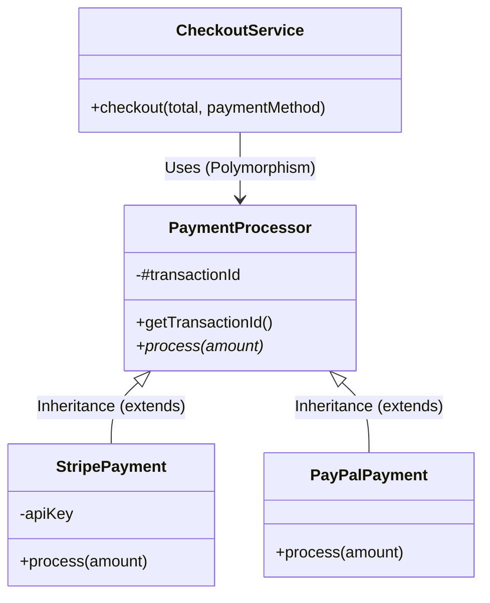

## Table of Contents (فهرست مطالب)

- [1. مقدمه‌ای بر OOP](#1-مقدمه‌ای-بر-oop)
- [2. Object در JavaScript](#2-object-در-javascript)
- [3. Class در JavaScript](#3-class-در-javascript)
- [4. Prototype و Prototype Chain](#4-prototype-و-prototype-chain)
- [5. Encapsulation](#5-encapsulation)
- [6. Abstraction](#6-abstraction)
- [7. Inheritance](#7-inheritance)
- [8. Polymorphism](#8-polymorphism)
- [9. ارتباط مفاهیم OOP](#9-ارتباط-مفاهیم-oop)
- [10. Composition در برابر Inheritance](#10-composition-در-برابر-inheritance)
- [11. اشتباهات رایج در طراحی شیءگرا](#11-اشتباهات-رایج-در-طراحی-شیءگرا)
- [12. مباحث پیشرفته](#12-مباحث-پیشرفته)
- [13. تمرین‌ها](#13-تمرین‌ها)
- [14. جمع‌بندی](#14-جمع‌بندی)
- [15. منابع](#15-منابع)

---

## 1. مقدمه‌ای بر OOP

### 1.1 برنامه‌نویسی شیءگرا چیست؟
برنامه‌نویسی شیءگرا (Object-Oriented Programming یا OOP) یک پارادایم (الگو) طراحی نرم‌افزار است که بر پایه مفهوم «اشیاء» (Objects) بنا شده است. هر شیء می‌تواند شامل **داده** (State/وضعیت) و **رفتار** (Behavior/عملکرد) مرتبط با آن داده باشد.

**چرا به وجود آمد؟** در برنامه‌های بزرگ، مدیریت داده‌ها و توابع پراکنده (برنامه‌نویسی رویه‌ای یا Procedural) پیچیده و مستعد خطا می‌شود. OOP با گروه‌بندی داده‌ها و رفتارهای مرتبط درون یک واحد منطقی (Object)، نگهداری، توسعه و درک کد را آسان‌تر می‌کند.

**مثال واقعی:** یک «خودرو» را در نظر بگیرید. 
- **State (وضعیت):** رنگ، سرعت، میزان سوخت.
- **Behavior (رفتار):** روشن شدن، ترمز کردن، شتاب گرفتن.

**مثال ساده در JavaScript:**
```javascript
const car = {
  color: "white", // State (داده)
  speed: 0,

  // Behavior (رفتار)
  start() {
    console.log("Car started.");
  },
  
  accelerate(amount) {
    this.speed += amount;
    console.log(`Speed is now ${this.speed}`);
  }
};

car.start(); // خروجی: Car started.
car.accelerate(20); // خروجی: Speed is now 20
```
در این مثال، `color` و `speed` وضعیت شیء هستند و `start` و `accelerate` رفتارهای آن. این شیء هنوز از `class` استفاده نمی‌کند، زیرا در JavaScript هر چیزی می‌تواند مستقیماً به‌صورت یک Object ساخته شود.

### 1.2 چهار اصل اصلی OOP
1. **Encapsulation (کپسوله‌سازی):** بسته‌بندی داده‌ها و متدها در یک واحد و محدود کردن دسترسی مستقیم به برخی اجزای داخلی. *(کلید: مخفی‌کردن جزئیات داخلی)*
2. **Abstraction (انتزاع):** پنهان‌کردن پیچیدگی‌های پیاده‌سازی و نمایش فقط ویژگی‌ها و رفتارهای ضروری به کاربر. *(کلید: نمایش فقط آنچه لازم است)*
3. **Inheritance (وراثت):** مکانیزمی برای ایجاد یک کلاس جدید بر پایه یک کلاس موجود، جهت استفاده مجدد از کد و ایجاد سلسله‌مراتب. *(کلید: رابطه "is-a" یا "یک نوع از")*
4. **Polymorphism (چندریختی):** توانایی یک شیء برای گرفتن اشکال مختلف؛ به‌طوری‌که یک رابط (Interface) یا نام متد واحد، رفتارهای متفاوتی را در اشیاء مختلف اجرا کند. *(کلید: یک نام، رفتارهای متفاوت)*

### 1.3 آیا JavaScript واقعاً شیءگراست؟
JavaScript یک زبان **Prototype-based** (مبتنی بر نمونه اولیه) و **Multi-paradigm** (چندالگویی) است. این بدان معناست که:
- JavaScript از OOP پشتیبانی می‌کند، اما نه دقیقاً مانند زبان‌های Class-based مانند Java یا C#.
- شما می‌توانید در JavaScript به‌صورت Functional (تابعی) یا Procedural (رویه‌ای) نیز کد بنویسید.
- کلمه کلیدی `class` در JavaScript (که از ES2015 معرفی شد) در واقع یک **Syntax Sugar** (شکر نحوی) و یک لایه انتزاعی روی همان سیستم Prototype قدیمی است، نه یک مدل شیءگرای کلاسیک جدید.

---

## 2. Object در JavaScript

### 2.1 Object چیست؟
در JavaScript، یک Object مجموعه‌ای از جفت‌های **Key-Value** (کلید-مقدار) است. 
- **Property (ویژگی):** یک Key که به یک داده (مقدار) اشاره دارد (State).
- **Method (متد):** یک Property که مقدار آن یک Function است (Behavior).

```javascript
const person = {
  name: "Ali", // Property
  age: 25,     // Property

  // Method
  sayHello() {
    console.log(`Hello, I am ${this.name}`);
  }
};

person.sayHello(); // خروجی: Hello, I am Ali
```
در اینجا، `this` به خود شیء `person` اشاره می‌کند.

### 2.2 روش‌های ساخت Object
1. **Object Literal (رایج‌ترین و ساده‌ترین):** `{ key: value }`
2. **`new Object()`:** کمتر رایج، معادل Literal است اما با سربار فراخوانی تابع.
3. **Constructor Function:** توابعی که با `new` صدا زده می‌شوند (روش قدیمی قبل از `class`).
4. **`Object.create(proto)`:** ساخت یک شیء جدید با تنظیم مستقیم `[[Prototype]]` آن.
5. **`class`:** روش مدرن و خوانا برای تعریف الگوی ساخت اشیاء.

### 2.3 State و Behavior
بهترین طراحی OOP زمانی است که **رفتار مرتبط با داده، در کنار همان داده** قرار گیرد. 
مثال `BankAccount`:
```javascript
const bankAccount = {
  balance: 1000, // State
  deposit(amount) { // Behavior
    if (amount > 0) this.balance += amount;
  }
};
```
اگر `balance` و `deposit` جدا باشند، مدیریت وضعیت (State) برنامه بسیار دشوار و مستعد خطا خواهد شد.

---

## 3. Class در JavaScript

### 3.1 Class چیست؟
یک `class` در JavaScript یک **Blueprint** (نقشه یا قالب) برای ساخت Objectهاست. خودِ Class یک شیء نیست، بلکه دستورالعملی است که می‌گوید اشیاء ساخته‌شده از آن، چه ویژگی‌ها و رفتارهایی خواهند داشت. کلمه کلیدی `new` یک نمونه جدید (Instance) از آن قالب را در حافظه ایجاد می‌کند.

```javascript
class Person {
  constructor(name) {
    this.name = name; // مقداردهی اولیه
  }

  sayHello() {
    console.log(`Hello, I am ${this.name}`);
  }
}

const person1 = new Person("Ali");
person1.sayHello(); // خروجی: Hello, I am Ali
```

### 3.2 اجزای Class در JavaScript
- **Class Declaration / Expression:** نحوه تعریف کلاس (با نام یا بی‌نام).
- **Constructor:** متد ویژه‌ای که هنگام ساخت شیء با `new` اجرا می‌شود.
- **Instance Fields / Methods:** ویژگی‌ها و متدهایی که به هر نمونه (Instance) تعلق دارند.
- **Static Fields / Methods:** ویژگی‌ها و متدهایی که به خودِ کلاس تعلق دارند، نه نمونه‌ها.
- **Getters / Setters:** توابعی که مانند Property دسترسی می‌شوند اما منطق داخلی دارند.
- **Private Fields / Methods:** با پیشوند `#` تعریف می‌شوند و فقط درون کلاس قابل دسترسی هستند.

### 3.3 Constructor
`constructor` متدی است که به‌طور خودکار هنگام فراخوانی `new ClassName()` اجرا می‌شود. اگر آن را ننویسید، JavaScript یک constructor خالی پیش‌فرض ایجاد می‌کند. در کلاس‌های فرزند، فراخوانی `super()` در constructor اجباری است.

```javascript
class BankAccount {
  constructor(owner, initialBalance) {
    this.owner = owner;
    this.balance = initialBalance;
  }
}
const account = new BankAccount("Sara", 500);
```

### 3.4 Instance و Static
- **Instance Member:** برای هر شیء ساخته‌شده جداگانه وجود دارد (با `this` دسترسی دارد).
- **Static Member:** فقط یک بار وجود دارد و متعلق به خود کلاس است. برای توابع کمکی (Utility) که به داده‌های نمونه خاصی نیاز ندارند، استفاده می‌شود.

```javascript
class MathHelper {
  static PI = 3.14159; // Static Field

  static add(a, b) {   // Static Method
    return a + b;
  }
}

console.log(MathHelper.add(2, 3)); // 5
// console.log(MathHelper.PI); // 3.14159
// const m = new MathHelper(); m.add(1, 2); // خطا! متد استاتیک روی نمونه قابل دسترسی نیست.
```

### 3.5 Class Fields (فیلدهای کلاس)
در استاندارد مدرن JavaScript، می‌توان فیلدها را مستقیماً در بدنه کلاس تعریف کرد (خارج از constructor).

```javascript
class User {
  role = "user";       // Public Instance Field
  #password = "secret"; // Private Instance Field (فقط داخل کلاس قابل دسترسی است)

  constructor(name) {
    this.name = name;
  }
}
```

### 3.6 Getters و Setters
این‌ها به شما اجازه می‌دهند دسترسی به یک Property را کنترل کنید، گویی که یک متغیر ساده است، اما در پشت صحنه منطق (مثل اعتبارسنجی) اجرا می‌شود.

```javascript
class Temperature {
  constructor(celsius) {
    this._celsius = celsius; // _ فقط یک قرارداد نام‌گذاری است، واقعاً خصوصی نیست!
  }

  get celsius() {
    return this._celsius;
  }

  set celsius(value) {
    if (value < -273.15) {
      throw new Error("Temperature cannot be below absolute zero.");
    }
    this._celsius = value;
  }
}

const temp = new Temperature(25);
temp.celsius = 30; // Setter فراخوانی می‌شود
// temp.celsius = -300; // خطا می‌دهد
```
*نکته مهم:* `_celsius` در JavaScript به‌معنای واقعی کلمه Private نیست و هنوز از بیرون قابل خواندن/تغییر است. برای حریم خصوصی واقعی، باید از `#` استفاده کرد.

### 3.7 مباحث پیشرفته Class
- **Class Expression:** `const MyClass = class { ... }` (برای الگوهای پیشرفته یا IIFE).
- **Static Initialization Blocks:** `static { ... }` برای اجرای منطق پیچیده هنگام بارگذاری کلاس (ES2022).
- **`new.target`:** متا-پراپرتی‌ای که مشخص می‌کند آیا کلاس با `new` فراخوانی شده یا خیر.
- *توجه:* این مباحث برای شروع ضروری نیستند، اما برای درک عمیق‌تر موتور JavaScript مفیدند.

---

## 4. Prototype و Prototype Chain

### 4.1 Prototype چیست؟
JavaScript یک زبان **Prototype-based** است. هر شیء در JavaScript یک لینک پنهان به یک شیء دیگر دارد که به آن **Prototype** می‌گویند. وقتی به یک Property دسترسی می‌خواهید، JavaScript ابتدا خود شیء را بررسی می‌کند؛ اگر پیدا نکرد، به Prototype آن مراجعه می‌کند.

- `prototype`: یک Property روی توابع Constructor و Classها که الگوی اشیاء ساخته‌شده را تعیین می‌کند.
- `[[Prototype]]`: لینک داخلی و پنهان هر شیء به شیء نمونه اولیه‌اش.
- `__proto__`: یک Getter/Setter منسوخ (Deprecated) برای دسترسی به `[[Prototype]]`.
- `Object.getPrototypeOf(obj)`: روش استاندارد و توصیه‌شده برای دریافت Prototype یک شیء.

```javascript
const person = { name: "Ali" };
console.log(Object.getPrototypeOf(person) === Object.prototype); // true
```

### 4.2 Prototype Chain (زنجیره نمونه اولیه)
وقتی `obj.prop` را فراخوانی می‌کنید:
1. آیا `prop` در خود `obj` وجود دارد؟ اگر بله، برگردان.
2. اگر نه، به `[[Prototype]]` شیء `obj` برو و جست‌وجو کن.
3. این فرآیند تا رسیدن به `Object.prototype` ادامه می‌یابد.
4. اگر در آنجا هم پیدا نشد، `[[Prototype]]` بعدی `null` است و مقدار `undefined` برگردانده می‌شود.

### 4.3 Constructor Function و Prototype
قبل از معرفی `class`، از توابع سازنده استفاده می‌شد. متدها روی `prototype` تابع قرار می‌گرفتند تا در حافظه به اشتراک گذاشته شوند (به‌جای اینکه برای هر نمونه کپی شوند).

```javascript
function Person(name) {
  this.name = name; // State روی هر نمونه
}

// Behavior روی Prototype (مشترک بین همه نمونه‌ها)
Person.prototype.sayHello = function () {
  console.log(`Hello, I am ${this.name}`);
};

const p1 = new Person("Ali");
const p2 = new Person("Reza");
// p1.sayHello و p2.sayHello هر دو به یک تابع در Person.prototype اشاره می‌کنند.
```

### 4.4 ارتباط Class و Prototype
کلمه کلیدی `class` در JavaScript فقط یک ظاهر تمیزتر برای همان منطق Constructor Function و Prototype است.
```javascript
class Person {
  sayHello() { console.log("Hello"); }
}
// در پشت صحنه، sayHello روی Person.prototype قرار می‌گیرد، نه روی خود نمونه!
```
این یعنی دو شیء ساخته‌شده از یک کلاس، متد مشترکی را از طریق Prototype Chain به اشتراک می‌گذارند که باعث صرفه‌جویی در حافظه می‌شود.

### 4.5 مباحث پیشرفته Prototype
- **Shadowing:** اگر یک Property هم‌نام در شیء و Prototype آن وجود داشته باشد، Property شیء، نسخه Prototype را «پنهان» (Shadow) می‌کند.
- **Prototype Pollution:** یک آسیب‌پذیری امنیتی که در آن مهاجم `Object.prototype` را تغییر می‌دهد و روی همه اشیاء برنامه تأثیر می‌گذارد.
- *هشدار:* هرگز در Runtime (زمان اجرا) Prototype اشیاء Built-in (مثل `Array.prototype`) را تغییر ندهید.

---

## 5. Encapsulation

### 5.1 Encapsulation چیست؟
کپسوله‌سازی به‌معنای بسته‌بندی داده‌ها و متدها در یک واحد و **محدود کردن دسترسی مستقیم** به برخی از اجزای داخلی شیء است. هدف، جلوگیری از قرار گرفتن شیء در وضعیت نامعتبر (Invalid State) و پنهان‌کردن پیچیدگی‌های داخلی است.

### 5.2 Encapsulation در JavaScript
JavaScript چندین سطح برای این کار دارد:
1. **Convention (`_name`):** فقط یک توافق بین برنامه‌نویسان است. موتور JS جلوی دسترسی را نمی‌گیرد.
2. **Closure / Factory Function:** استفاده از Scope توابع برای پنهان‌کردن متغیرها (بسیار قدرتمند و واقعی).
3. **Private Fields (`#name`):** ویژگی رسمی و مدرن ES2022 که دسترسی از بیرون کلاس را به‌صورت سخت‌افزاری مسدود می‌کند.
4. **WeakMap:** برای نگهداری داده‌های خصوصی مرتبط با اشیاء (الگوی پیشرفته).

### 5.3 مثال بد و مثال خوب
**مثال بد (بدون Encapsulation):**
```javascript
class BankAccount {
  constructor() {
    this.balance = 0; // هر کدی می‌تواند این را تغییر دهد: account.balance = -1000;
  }
}
```

**مثال خوب (با Private Field):**
```javascript
class BankAccount {
  #balance = 0; // Private Field واقعی

  deposit(amount) {
    if (amount <= 0) throw new Error("Amount must be positive.");
    this.#balance += amount;
  }

  getBalance() {
    return this.#balance;
  }
}
// account.#balance = 1000; // خطای Syntax: Private field '#balance' must be declared in an enclosing class
```

### 5.4 Encapsulation با Closure
```javascript
function createBankAccount(initialBalance = 0) {
  let balance = initialBalance; // این متغیر در Closure پنهان است و از بیرون قابل دسترسی نیست

  return {
    deposit(amount) {
      if (amount <= 0) throw new Error("Invalid amount");
      balance += amount;
    },
    getBalance() {
      return balance;
    }
  };
}
const acc = createBankAccount(100);
// acc.balance; // undefined
```
این روش بدون نیاز به `class`، حریم خصوصی واقعی (True Privacy) ایجاد می‌کند.

### 5.5 اشتباهات رایج در Encapsulation
- استفاده از `_` و تصور اینکه داده واقعاً خصوصی است.
- عمومی (Public) کردن تمام فیلدها برای «راحتی» دسترسی.
- استفاده بی‌دلیل از Getter و Setter برای هر فیلد (فقط زمانی که منطق اعتبارسنجی یا محاسباتی وجود دارد).
- تصور اینکه `Object.freeze()` داده‌ها را خصوصی می‌کند (فقط آن‌ها را غیرقابل‌تغییر یا Read-only می‌کند، اما هنوز قابل مشاهده هستند).

---

## 6. Abstraction

### 6.1 Abstraction چیست؟
انتزاع به‌معنای پنهان‌کردن **جزئیات پیچیده پیاده‌سازی** و نمایش فقط **عملکردهای ضروری** به مصرف‌کننده است. 
- **تفاوت با Encapsulation:** Encapsulation درباره *مخفی‌کردن داده* برای محافظت از وضعیت است. Abstraction درباره *مخفی‌کردن پیچیدگی طراحی* برای ساده‌سازی استفاده است.
- *مثال واقعی:* شما برای رانندگی نیاز ندارید بدانید موتور احتراق داخلی چگونه کار می‌کند (Abstraction)؛ و شما نمی‌توانید مستقیماً سیم‌کشی موتور را دستکاری کنید (Encapsulation).

### 6.2 Abstraction در JavaScript
JavaScript کلمه کلیدی `abstract` یا `interface` ندارد. اما می‌توانیم با الگوهای زیر به انتزاع برسیم:
1. **پرتاب خطا در متدهای پایه:** برای ایجاد یک قرارداد (Contract) دستی.
2. **Factory Functions:** بازگرداندن فقط متدهای عمومی و پنهان‌کردن توابع کمکی داخلی.
3. **Module Pattern:** استفاده از `export` برای آشکارسازی فقط API عمومی و پنهان‌کردن توابع داخلی ماژول.

```javascript
class NotificationService {
  send(message) {
    throw new Error("send() must be implemented by subclass.");
  }
}
```

### 6.3 Abstraction با Interface-like Contract (Duck Typing)
در JavaScript، به‌جای بررسی نوع کلاس، بررسی می‌کنیم که آیا شیء رفتار مورد نیاز را دارد یا خیر (اگر مثل اردک راه می‌رود و صدا می‌دهد، پس اردک است).

```javascript
function sendNotification(service, message) {
  // ما اهمیتی نمی‌دهیم service چه کلاسی دارد، فقط باید متد send داشته باشد
  service.send(message);
}

const emailService = { send: (msg) => console.log(`Email: ${msg}`) };
const smsService = { send: (msg) => console.log(`SMS: ${msg}`) };

sendNotification(emailService, "Hello"); // Email: Hello
sendNotification(smsService, "Hi");      // SMS: Hi
```

### 6.4 مباحث پیشرفته Abstraction
- **Dependency Injection (DI):** تزریق وابستگی‌ها (مثل سرویس‌ها) به‌جای ساخت مستقیم آن‌ها درون کلاس، که باعث Loose Coupling (وابستگی سست) می‌شود.
- **Abstraction بیش‌ازحد:** ایجاد لایه‌های بی‌دلیل که کد را پیچیده و غیرقابل‌درک می‌کند. انتزاع باید زمانی انجام شود که واقعاً نیاز باشد.

---

## 7. Inheritance

### 7.1 Inheritance چیست؟
وراثت مکانیزمی است که در آن یک کلاس (Derived/Child) ویژگی‌ها و رفتارهای یک کلاس دیگر (Base/Parent) را به ارث می‌برد. این رابطه معمولاً یک رابطه **"is-a"** (یک نوع از) است.

```javascript
class Animal {
  constructor(name) {
    this.name = name;
  }
  eat() {
    console.log(`${this.name} is eating.`);
  }
}

class Dog extends Animal {
  bark() {
    console.log("Dog is barking.");
  }
}

const myDog = new Dog("Rex");
myDog.eat();  // ارث‌بری شده از Animal: Rex is eating.
myDog.bark(); // متد اختصاصی Dog: Dog is barking.
```

### 7.2 Inheritance با `extends` و `super`
- `extends`: زنجیره Prototype را بین کلاس فرزند و والد برقرار می‌کند.
- `super()`: در constructor کلاس فرزند، **باید** قبل از استفاده از `this` فراخوانی شود تا کلاس والد مقداردهی اولیه شود.
- `super.methodName()`: برای فراخوانی نسخه والد یک متد که در کلاس فرزند بازنویسی (Override) شده است.

```javascript
class Dog extends Animal {
  constructor(name, breed) {
    super(name); // فراخوانی constructor والد
    this.breed = breed;
  }
  
  eat() {
    super.eat(); // استفاده از منطق والد
    console.log("Dog eats fast.");
  }
}
```
*نکته:* JavaScript از **Multiple Inheritance** (ارث‌بری از چند کلاس هم‌زمان) بین کلاس‌ها پشتیبانی نمی‌کند.

### 7.3 `instanceof`
عملگر `instanceof` بررسی می‌کند که آیا `prototype` یک کلاس در زنجیره نمونه اولیه یک شیء وجود دارد یا خیر.
```javascript
console.log(myDog instanceof Dog);    // true
console.log(myDog instanceof Animal); // true
console.log(myDog instanceof Object); // true
```

### 7.4 Inheritance در طراحی واقعی
وراثت فقط برای "استفاده مجدد از کد" (Code Reuse) نیست. اگر رابطه "is-a" برقرار نباشد، استفاده از وراثت یک ضدالگو (Anti-pattern) است. در این موارد، **Composition** (ترکیب) گزینه بهتری است.

---

## 8. Polymorphism

### 8.1 Polymorphism چیست؟
چندریختی به این معنی است که یک رابط (Interface) یا نام متد واحد، می‌تواند رفتارهای متفاوتی را در اشیاء مختلف از انواع مختلف اجرا کند. این مفهوم فقط محدود به وراثت کلاس‌ها نیست.

### 8.2 Polymorphism با Inheritance
```javascript
class Payment {
  pay(amount) { throw new Error("Must be implemented"); }
}

class CardPayment extends Payment {
  pay(amount) { console.log(`Paid ${amount} by Card.`); }
}

class CashPayment extends Payment {
  pay(amount) { console.log(`Paid ${amount} by Cash.`); }
}

function processPayment(paymentMethod, amount) {
  // این تابع نمی‌داند paymentMethod دقیقاً چیست، فقط می‌داند که متد pay دارد.
  paymentMethod.pay(amount);
}

processPayment(new CardPayment(), 100); // Paid 100 by Card.
processPayment(new CashPayment(), 50);  // Paid 50 by Cash.
```

### 8.3 Polymorphism با Duck Typing
همان‌طور که در بخش Abstraction دیدیم، در JavaScript نیازی به وراثت از یک کلاس پایه مشترک برای چندریختی نیست. هر شیئی که متد `pay` داشته باشد، می‌تواند به تابع `processPayment` داده شود. این انعطاف‌پذیری ذاتی JavaScript است.

### 8.4 Compile-Time و Runtime Polymorphism
- JavaScript یک زبان تفسیری (Interpreted/JIT-compiled) با تایپ پویا (Dynamic Typing) است، بنابراین **Compile-Time Polymorphism** (مثل Method Overloading در C#) را به‌صورت بومی ندارد.
- **Method Overloading** (چند متد هم‌نام با پارامترهای متفاوت) در JavaScript وجود ندارد. اگر چند متد هم‌نام تعریف کنید، آخرین تعریف، قبلی‌ها را بازنویسی می‌کند.
- شبیه‌سازی Overloading در JS با بررسی تعداد یا نوع آرگومان‌ها انجام می‌شود:
```javascript
class Calculator {
  add(a, b, c) {
    if (c !== undefined) return a + b + c;
    return a + b;
  }
}
```
این Overloading واقعی نیست، بلکه مدیریت دستی آرگومان‌هاست.

---

## 9. ارتباط مفاهیم OOP

بیایید یک سیستم پرداخت ساده را طراحی کنیم که تمام مفاهیم را ترکیب می‌کند:

```javascript
// 1. Abstraction & Encapsulation: کلاس پایه با متد خصوصی و قرارداد
class PaymentProcessor {
  #transactionId; // Private Field (Encapsulation)

  constructor() {
    this.#transactionId = this.#generateId();
  }

  #generateId() { // Private Method
    return Math.random().toString(36).substr(2, 9);
  }

  getTransactionId() {
    return this.#transactionId;
  }

  // Abstract Method (Contract)
  process(amount) {
    throw new Error("process() must be implemented");
  }
}

// 2. Inheritance & Polymorphism
class StripePayment extends PaymentProcessor {
  constructor(apiKey) {
    super(); // Inheritance
    this.apiKey = apiKey;
  }

  // Polymorphism: بازنویسی متد والد
  process(amount) {
    console.log(`Processing ${amount} via Stripe. TxID: ${this.getTransactionId()}`);
  }
}

class PayPalPayment extends PaymentProcessor {
  process(amount) {
    console.log(`Processing ${amount} via PayPal. TxID: ${this.getTransactionId()}`);
  }
}

// 3. Polymorphism in Action (Duck Typing / Contract)
function checkout(cartTotal, paymentMethod) {
  console.log("Starting checkout...");
  paymentMethod.process(cartTotal); // رفتار متفاوت بر اساس نوع شیء
  console.log("Checkout complete.");
}

const myPayment = new StripePayment("sk_test_123");
checkout(250, myPayment); 
// خروجی:
// Starting checkout...
// Processing 250 via Stripe. TxID: x7k9m2p1q
// Checkout complete.
```
**نقش Prototype در اینجا:** متد `process` در `StripePayment` و `PayPalPayment` روی `prototype` آن‌ها ذخیره می‌شود، نه در هر نمونه. این باعث بهینه‌سازی حافظه می‌شود.



---

## 10. Composition در برابر Inheritance

### 10.1 Composition چیست؟
ترکیب (Composition) الگویی است که در آن یک کلاس، شامل اشیایی از کلاس‌های دیگر به‌عنوان Property است (رابطه **"has-a"** یا "دارای").

```javascript
class Engine {
  start() { console.log("Engine started."); }
}

class Car {
  constructor(engine) {
    this.engine = engine; // Composition: Car "has an" Engine
  }
  
  start() {
    this.engine.start(); // تفویض رفتار به شیء ترکیب‌شده
  }
}

const myCar = new Car(new Engine());
myCar.start();
```

### 10.2 چه زمانی Composition بهتر است؟
- وقتی رفتارها قابل‌تعویض هستند (مثلاً تغییر موتور بنزینی به الکتریکی بدون تغییر کل ساختار `Car`).
- وقتی می‌خواهید از ایجاد سلسله‌مراتب عمیق و پیچیده (Deep Inheritance Hierarchy) جلوگیری کنید.
- وقتی رابطه "is-a" منطقی نیست (مثلاً `Car` یک نوع `Engine` نیست، بلکه `Engine` دارد).
- تست‌نویسی (Unit Testing) با Composition بسیار آسان‌تر است (می‌توانید یک `MockEngine` تزریق کنید).

> **قانون طلایی:** "Favor Composition over Inheritance" (ترکیب را بر وراثت ترجیح دهید).

---

## 11. اشتباهات رایج در طراحی شیءگرا

1. **God Object:** کلاسی که همه‌کاره است و صدها خط کد دارد. *(راهکار: شکستن به کلاس‌های کوچک‌تر با مسئولیت واحد - SRP)*
2. **استفاده بی‌دلیل از Inheritance:** فقط برای به‌ارث‌بردن یک متد، در حالی که رابطه "is-a" برقرار نیست. *(راهکار: استفاده از Composition)*
3. **عمومی کردن تمام داده‌ها:** قرار دادن همه فیلدها به‌صورت Public. *(راهکار: استفاده از `#` یا Closure)*
4. **تغییر Prototypeهای Built-in:** مثلاً `Array.prototype.myMethod = ...`. *(راهکار: هرگز این کار را نکنید، باعث تداخل و باگ‌های غیرقابل‌ردیابی می‌شود)*
5. **استفاده بیش‌ازحد از Class:** برای داده‌های ساده یا توابع خالص (Pure Functions)، Object Literal یا ماژول‌های ساده کافی و بهتر هستند.

---

## 12. مباحث پیشرفته

این بخش برای آشنایی اولیه است و نیاز به مطالعه جداگانه دارد:
- **SOLID Principles:** پنج اصل طراحی شیءگرا (SRP, OCP, LSP, ISP, DIP) که پایه نرم‌افزار قابل‌نگهداری هستند.
- **Dependency Injection (DI):** الگویی برای ارائه وابستگی‌ها به کلاس به‌جای ساخت آن‌ها درون کلاس، که تست‌پذیری و انعطاف‌پذیری را افزایش می‌دهد.
- **Design Patterns:** الگوهای اثبات‌شده مثل **Strategy** (جایگزین عالی برای Inheritanceهای پیچیده)، **Factory** (ساخت اشیاء پیچیده)، و **Adapter** (هماهنگ‌کردن رابط‌های ناسازگار).
- **Mixins:** الگویی در JavaScript برای ترکیب رفتارهای چندین شیء در یک شیء واحد (با استفاده از `Object.assign` یا توابع کمکی)، به‌عنوان جایگزینی برای Multiple Inheritance.

---

## 13. تمرین‌ها

برای تسلط بر مفاهیم، سعی کنید این تمرین‌ها را خودتان حل کنید.

### تمرین ۱: Object و Class (سطح: مبتدی)
**صورت مسئله:** یک کلاس `Product` بسازید که `name` و `price` را در constructor بگیرد. یک متد `getDiscountedPrice(discountPercent)` داشته باشد که قیمت با تخفیف را برگرداند.
**مفاهیم:** Class, Constructor, Instance Method.
**راهنمایی:** از `this.name` و فرمول ریاضی ساده استفاده کنید.

### تمرین ۲: Encapsulation (سطح: متوسط)
**صورت مسئله:** کلاس `BankAccount` را طوری بازنویسی کنید که `balance` یک Private Field (`#`) باشد. متدهای `deposit(amount)` و `withdraw(amount)` را اضافه کنید. برداشت وجه فقط در صورتی مجاز است که موجودی کافی باشد، در غیر این صورت خطا پرتاب شود.
**مفاهیم:** Private Fields, Validation, Error Handling.
**راهنمایی:** از `if (amount > this.#balance)` برای بررسی استفاده کنید.

### تمرین ۳: Abstraction و Duck Typing (سطح: متوسط)
**صورت مسئله:** یک تابع `saveData(storage, data)` بنویسید. دو شیء `LocalStorage` و `Database` بسازید که هر دو متد `save(data)` داشته باشند اما پیاده‌سازی داخلی آن‌ها متفاوت باشد (یکی `console.log` و دیگری شبیه‌سازی تاخیر با `setTimeout`).
**مفاهیم:** Interface-like Contract, Polymorphism.
**راهنمایی:** تابع `saveData` نباید بداند `storage` دقیقاً چیست، فقط باید `storage.save(data)` را صدا بزند.

### تمرین ۴: Inheritance و Polymorphism (سطح: پیشرفته)
**صورت مسئله:** یک کلاس پایه `Shape` با متد `getArea()` (که خطا پرتاب می‌کند) بسازید. دو کلاس `Circle` (با شعاع) و `Rectangle` (با طول و عرض) از آن ارث‌بری کنند و `getArea` را بازنویسی (Override) کنند. یک آرایه از اشکال مختلف بسازید و با یک حلقه، مساحت همه را محاسبه و چاپ کنید.
**مفاهیم:** `extends`, `super`, Method Overriding, Polymorphic Iteration.
**راهنمایی:** از `Math.PI * r ** 2` برای دایره استفاده کنید.

---

## 14. جمع‌بندی

- **Object vs Class:** Object یک نمونه واقعی در حافظه با داده و رفتار است. Class یک قالب (Blueprint) برای ساخت آن اشیاء است.
- **Encapsulation vs Abstraction:** Encapsulation داده‌ها را برای *محافظت* پنهان می‌کند. Abstraction پیچیدگی را برای *سادگی استفاده* پنهان می‌کند.
- **Inheritance vs Composition:** وراثت رابطه "is-a" است و سلسله‌مراتب می‌سازد. ترکیب رابطه "has-a" است و انعطاف‌پذیری بالاتری دارد (ترکیب را ترجیح دهید).
- **Overloading vs Overriding:** JavaScript Overloading (چند متد هم‌نام) ندارد، اما Overriding (بازنویسی متد والد در فرزند) را به‌خوبی پشتیبانی می‌کند.
- **نقش Prototype:** حتی وقتی از `class` استفاده می‌کنید، موتور JavaScript در پشت صحنه از Prototype Chain برای به‌اشتراک‌گذاری متدها و مدیریت وراثت استفاده می‌کند. درک این موضوع برای عیب‌یابی پیشرفته ضروری است.

**مسیر پیشنهادی ادامه یادگیری:** پس از تسلط بر این مفاهیم، مطالعه اصول **SOLID**، الگوهای طراحی (Design Patterns) و نحوه مدیریت State در فریم‌ورک‌های مدرن (مثل React یا Node.js) با استفاده از این اصول را آغاز کنید.

---

## 15. منابع

برای مطالعه عمیق‌تر و بررسی جزئیات فنی، از منابع رسمی و معتبر زیر استفاده کنید:

1. **MDN Web Docs — Classes**  
   مرجع رسمی و کامل درباره سینتکس و رفتار کلاس‌ها در JavaScript.  
   🔗 [developer.mozilla.org/en-US/docs/Web/JavaScript/Reference/Classes](https://developer.mozilla.org/en-US/docs/Web/JavaScript/Reference/Classes)

2. **MDN Web Docs — Inheritance and the Prototype Chain**  
   بهترین منبع برای درک عمیق مکانیزم Prototype در JavaScript.  
   🔗 [developer.mozilla.org/en-US/docs/Web/JavaScript/Guide/Inheritance_and_the_prototype_chain](https://developer.mozilla.org/en-US/docs/Web/JavaScript/Guide/Inheritance_and_the_prototype_chain)

3. **MDN Web Docs — Private Class Features**  
   توضیحات رسمی درباره فیلدها و متدهای خصوصی (`#`) و پشتیبانی محیط‌های اجرا.  
   🔗 [developer.mozilla.org/en-US/docs/Web/JavaScript/Reference/Classes/Private_elements](https://developer.mozilla.org/en-US/docs/Web/JavaScript/Reference/Classes/Private_elements)

4. **JavaScript.info — Classes & Prototypes**  
   منبعی عالی با توضیحات گام‌به‌گام و مثال‌های آموزشی روان.  
   🔗 [javascript.info/classes](https://javascript.info/classes)  
   🔗 [javascript.info/prototypes](https://javascript.info/prototypes)

5. **ECMAScript Language Specification**  
   مرجع نهایی و استاندارد زبان JavaScript (برای بررسی رفتارهای دقیق موتور زبان).  
   🔗 [tc39.es/ecma262/](https://tc39.es/ecma262/)

*توجه: تمام مثال‌های کد این سند با استانداردهای مدرن ECMAScript (ES2022 و بالاتر) سازگار هستند و در محیط‌های اجرای به‌روز (Node.js 16+ و مرورگرهای مدرن) بدون نیاز به Transpiler قابل اجرا می‌باشند.*
